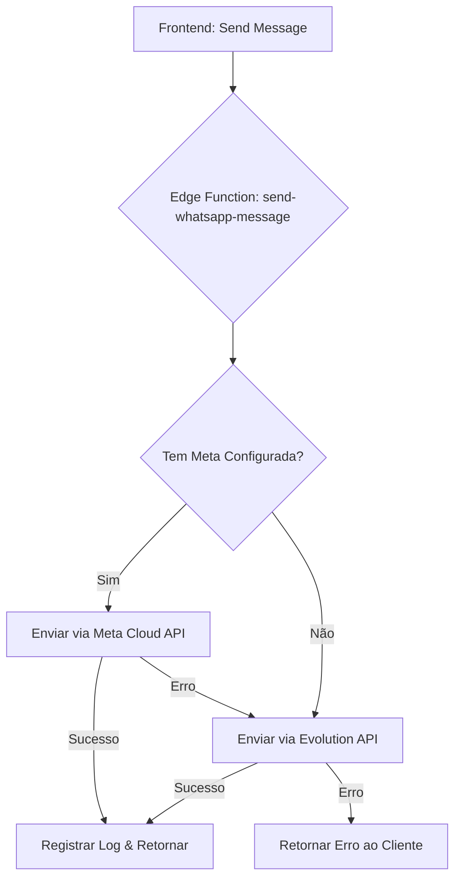

# Proposta de Arquitetura Híbrida: Meta Cloud API + Evolution API (Dual-Gateway)

**Data:** 20 de Dezembro de 2025
**Autor:** Arquiteto de Software Sênior (Kilo Code)
**Status:** Proposta Técnica

---

## 1. Visão Executiva

Esta proposta detalha a implementação de uma arquitetura de mensageria híbrida ("Dual-Gateway") que integra a **API Oficial do WhatsApp (Meta Cloud API)** ao ecossistema existente baseado na **Evolution API**.

O objetivo é elevar a confiabilidade e estabilidade do envio e recebimento de mensagens críticas (transacionais e atendimento) utilizando a infraestrutura oficial da Meta, enquanto preservamos a Evolution API para funcionalidades avançadas não suportadas nativamente (gestão de grupos, extração de contatos, fotos de perfil).

## 2. Análise do Legado (Estado Atual)

Atualmente, o sistema opera em um modelo de dependência única da Evolution API:

*   **Envio:** O frontend (`SendWhatsAppDialog`) invoca a Edge Function `send-evolution-text`, que valida o número e repassa a requisição para a instância Evolution conectada.
*   **Recebimento:** A Edge Function `configure-evolution-webhook` configura a Evolution API para enviar webhooks diretamente para um workflow n8n (`/webhook/agente-sdr`).
*   **Persistência:**
    *   `evolution_instances`: Gerencia o estado da conexão (QR Code).
    *   `evolution_contacts`: Armazena contatos sincronizados.

**Pontos de Dor Identificados:**
*   Dependência de conexão via QR Code (instável em alto volume).
*   Risco de banimento em envios massivos (não oficial).
*   Latência na sincronização de mensagens.

## 3. Arquitetura Híbrida Proposta (Dual-Gateway)

A nova arquitetura introduz uma camada de abstração ("Message Router") que decide qual gateway utilizar com base no tipo de operação e na disponibilidade.

### 3.1. Componentes Chave

1.  **Tabela `whatsapp_providers` (Nova):**
    *   Gerencia as credenciais e configurações de cada provedor (Meta vs. Evolution).
    *   Permite que um cliente tenha ambos os provedores ativos simultaneamente.

2.  **Edge Function `send-whatsapp-message` (Unificada):**
    *   Substitui a `send-evolution-text`.
    *   **Lógica de Roteamento:**
        *   Se o cliente possui Meta API configurada -> Usa Meta API (Prioridade).
        *   Se não, ou se falhar (fallback) -> Usa Evolution API.
        *   Para funcionalidades específicas (ex: ler grupos) -> Força Evolution API.

3.  **Webhook Unificado (Supabase Edge Function):**
    *   Novo endpoint `webhook-whatsapp-gateway`.
    *   Recebe payloads tanto da Meta quanto da Evolution.
    *   **Normalização:** Converte ambos os formatos para um esquema padrão interno (`UnifiedMessage`).
    *   **Despacho:** Envia o payload normalizado para o n8n ou processa internamente.

### 3.2. Fluxo de Decisão (Envio)



## 4. Normalização de Dados

Para garantir que o restante do sistema (CRM, Chat, n8n) seja agnóstico ao provedor, implementaremos uma camada de normalização.

### 4.1. Payload Unificado (Entrada/Saída)

```typescript
interface UnifiedMessage {
  id: string;              // ID da mensagem (WAMID ou ID Evolution)
  remoteJid: string;       // Formato E.164 (ex: 5511999999999)
  fromMe: boolean;
  type: 'text' | 'image' | 'audio' | 'document' | 'template';
  content: string;         // Texto ou Caption
  mediaUrl?: string;       // Para mídia
  timestamp: number;
  provider: 'meta' | 'evolution';
  status: 'sent' | 'delivered' | 'read' | 'failed';
}
```

### 4.2. Estratégia de Webhooks

Criaremos uma Edge Function `webhook-normalizer` que atuará como middleware:

1.  **Endpoint Meta:** `POST /functions/v1/webhook-meta` -> Normaliza -> `POST /n8n/webhook/unified`
2.  **Endpoint Evolution:** `POST /functions/v1/webhook-evolution` -> Normaliza -> `POST /n8n/webhook/unified`

Isso permite que o workflow do n8n permaneça inalterado, recebendo sempre o mesmo formato JSON.

## 5. Gestão de Conflitos e Sessão

*   **Duplicidade:** O ID da mensagem (WAMID) será usado como chave de idempotência. Se uma mensagem já foi processada (verificação no banco), ela será ignorada.
*   **Janela de Conversa (24h):** A Meta API exige que o cliente inicie a conversa ou que se use Templates aprovados.
    *   *Estratégia:* Se a janela de 24h estiver fechada e for uma mensagem livre (não template), o sistema tentará automaticamente o fallback para a Evolution API (que não tem essa restrição, mas tem riscos).
*   **Sincronização de Contatos:** A Evolution API continuará sendo a fonte da verdade para fotos de perfil e nomes de contatos, pois a Meta API tem limitações de privacidade nisso.

## 6. Plano de Implementação

### Fase 1: Fundação (Backend)
1.  Criar tabela `whatsapp_providers` e `whatsapp_messages` (log unificado).
2.  Criar Edge Function `send-whatsapp-message` com lógica de roteamento.
3.  Implementar adaptadores para Meta Cloud API (envio de texto e templates).

### Fase 2: Webhooks e Normalização
1.  Criar Edge Function `webhook-meta` para validar e receber eventos da Meta.
2.  Criar lógica de normalização de payloads.
3.  Atualizar o n8n para aceitar o novo formato unificado (ou manter compatibilidade via adaptador).

### Fase 3: Frontend e Migração
1.  Atualizar `SendWhatsAppDialog` para usar a nova Edge Function unificada.
2.  Criar interface de configuração para credenciais da Meta (Token, Phone ID, WABA ID).
3.  Testes de regressão com Evolution API.

### Fase 4: Rollout Híbrido
1.  Habilitar Meta API para clientes "Beta".
2.  Monitorar taxas de entrega e erros.
3.  Ajustar regras de fallback conforme necessário.

---

**Próximos Passos:**
Aprovação desta arquitetura para início imediato da Fase 1 (Fundação).