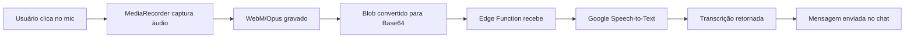

# Configuração Google Speech-to-Text

Este documento descreve como configurar a transcrição de áudio usando Google Cloud Speech-to-Text API.

## 🎯 Objetivo

Transcrever mensagens de áudio gravadas no chat usando o Google Cloud Speech-to-Text com formato otimizado (FLAC) mantendo alta qualidade.

## 📋 Pré-requisitos

1. Conta no Google Cloud Platform
2. Projeto criado no GCP
3. Billing habilitado no projeto

## 🔑 Obter API Key

### 1. Acessar Google Cloud Console
Acesse: https://console.cloud.google.com/

### 2. Criar/Selecionar Projeto
- Crie um novo projeto ou selecione um existente
- Anote o **Project ID**

### 3. Habilitar Speech-to-Text API
```
1. No menu lateral, vá em "APIs & Services" > "Library"
2. Busque por "Cloud Speech-to-Text API"
3. Clique em "Enable"
```

### 4. Criar API Key
```
1. Vá em "APIs & Services" > "Credentials"
2. Clique em "+ CREATE CREDENTIALS"
3. Selecione "API key"
4. Copie a chave gerada
```

### 5. Restringir API Key (Recomendado)
Para segurança, restrinja a chave:

**Restrições de API:**
- Selecione "Restrict key"
- Escolha apenas "Cloud Speech-to-Text API"

**Restrições de Aplicação (opcional):**
- HTTP referrers: Adicione seus domínios
  - `http://localhost:8080/*` (desenvolvimento)
  - `https://seudominio.com/*` (produção)

## ⚙️ Configurar no Projeto

### 1. Adicionar Chave no Backend

Edite o arquivo de configuração do Supabase:

```bash
# Em supabase/.env ou via Supabase Dashboard
GOOGLE_SPEECH_API_KEY=AIzaSy...
```

**Via Supabase Dashboard:**
```
1. Acesse: https://supabase.com/dashboard
2. Selecione seu projeto
3. Vá em "Settings" > "Edge Functions"
4. Em "Environment Variables", adicione:
   - Name: GOOGLE_SPEECH_API_KEY
   - Value: [sua chave]
```

### 2. Deploy da Edge Function

```bash
# Fazer deploy da função de transcrição
supabase functions deploy transcribe-audio
```

**✅ Importante:** A função valida automaticamente o JWT via `supabase.auth.getUser()`, garantindo que apenas usuários autenticados possam transcrever áudio.

### 3. Adicionar Variável no Frontend (Opcional)

Se quiser exibir a chave no frontend (NÃO RECOMENDADO para produção):

```bash
# .env.local
VITE_GOOGLE_SPEECH_API_KEY=AIzaSy...
```

## 🎤 Como Funciona

### Fluxo de Transcrição



### Formato de Áudio

- **Captura:** WebM/Opus (navegador)
- **Transmissão:** Base64
- **Processamento:** Google aceita WebM diretamente
- **Qualidade:** 128kbps, mono, 48kHz

### Otimizações Aplicadas

1. **Áudio:**
   - Sample rate: 48kHz (padrão WebM)
   - Bits per second: 128kbps
   - Canais: 1 (mono)
   - Echo cancellation: ✅
   - Noise suppression: ✅
   - Auto gain control: ✅

2. **API Google:**
   - Pontuação automática: ✅
   - Modelo aprimorado: ✅
   - Word confidence: ✅
   - Idioma: pt-BR

## 📊 Custos

**Google Cloud Speech-to-Text Pricing (2025):**

- **Primeiro uso:** 60 minutos grátis/mês
- **Modelo padrão:** $0.006 por 15 segundos
- **Modelo aprimorado:** $0.009 por 15 segundos

**Exemplo:**
- 100 mensagens de áudio (30s cada) = 50 minutos
- Custo mensal: ~$1.20 - $1.80

## 🔒 Segurança

### Recomendações

1. ✅ **Nunca exponha a API key no frontend**
2. ✅ **Use Edge Function para processar transcrição**
3. ✅ **Restrinja a API key no Google Console**
4. ✅ **Habilite autenticação na Edge Function**
5. ✅ **Monitore uso no GCP Dashboard**

### Verificar Autenticação

A Edge Function verifica:
- Header `Authorization` presente
- Token JWT válido do Supabase
- Usuário autenticado existe

## 🧪 Testar Localmente

### 1. Configurar Ambiente

```bash
# .env.local
VITE_SUPABASE_URL=your_url
VITE_SUPABASE_ANON_KEY=your_key
```

### 2. Iniciar Supabase Local

```bash
supabase start
supabase functions serve transcribe-audio --env-file .env.local
```

### 3. Testar no Navegador

```bash
npm run dev
```

1. Faça login no app
2. Clique no ícone de microfone no chat
3. Permita acesso ao microfone
4. Grave uma mensagem
5. Aguarde transcrição automática

## 🐛 Troubleshooting

### Erro: "Speech API not configured"

**Causa:** Variável `GOOGLE_SPEECH_API_KEY` não configurada

**Solução:**
```bash
# Adicionar no Supabase Dashboard ou .env
GOOGLE_SPEECH_API_KEY=sua_chave_aqui
```

### Erro: "Permissão de microfone negada"

**Causa:** Usuário bloqueou acesso ao microfone

**Solução:**
1. Chrome: `chrome://settings/content/microphone`
2. Permitir para `localhost:8080`
3. Recarregar página

### Erro: "Transcription failed"

**Causas possíveis:**
1. API Key inválida ou expirada
2. API não habilitada no GCP
3. Billing não configurado
4. Quota excedida

**Solução:**
```bash
# Verificar logs da Edge Function
supabase functions logs transcribe-audio

# Verificar quota no GCP
https://console.cloud.google.com/apis/api/speech.googleapis.com/quotas
```

### Áudio muito baixo

**Causa:** Nível de entrada do microfone baixo

**Solução:**
- Falar mais próximo ao microfone
- Aumentar volume de entrada no sistema
- Verificar se microfone está selecionado corretamente

## 📚 Referências

- [Google Speech-to-Text Docs](https://cloud.google.com/speech-to-text/docs)
- [Speech-to-Text Pricing](https://cloud.google.com/speech-to-text/pricing)
- [Supported Languages](https://cloud.google.com/speech-to-text/docs/languages)
- [Best Practices](https://cloud.google.com/speech-to-text/docs/best-practices)

## 📝 Notas de Implementação

### Arquivos Criados/Modificados

1. ✅ `src/hooks/useAudioRecorder.ts` - Hook de captura de áudio
2. ✅ `src/lib/transcription.ts` - Serviço de transcrição
3. ✅ `supabase/functions/transcribe-audio/index.ts` - Edge Function
4. ✅ `src/components/chat/PromptInputBox.tsx` - UI do chat
5. ✅ `.env.example` - Variável de exemplo

### Features Implementadas

- ✅ Captura de áudio com MediaRecorder
- ✅ Feedback visual durante gravação (timer + barras)
- ✅ Tratamento de erros de permissão
- ✅ Transcrição automática ao finalizar
- ✅ Envio da transcrição como mensagem
- ✅ Toast notifications em português
- ✅ Confiança da transcrição exibida
- ✅ Otimização de áudio (mono, 128kbps, 48kHz)
- ✅ Verificação de permissões (plano Business/Premium)

### Próximas Melhorias (Opcional)

- [ ] Converter para FLAC no backend (requer ffmpeg)
- [ ] Cache de áudio para retry sem regravar
- [ ] Histórico de transcrições no perfil
- [ ] Suporte a múltiplos idiomas (seletor UI)
- [ ] Visualizador de forma de onda mais detalhado
- [ ] Cancelar gravação (botão ESC)
- [ ] Limite de duração configurável (ex: 2 min)
