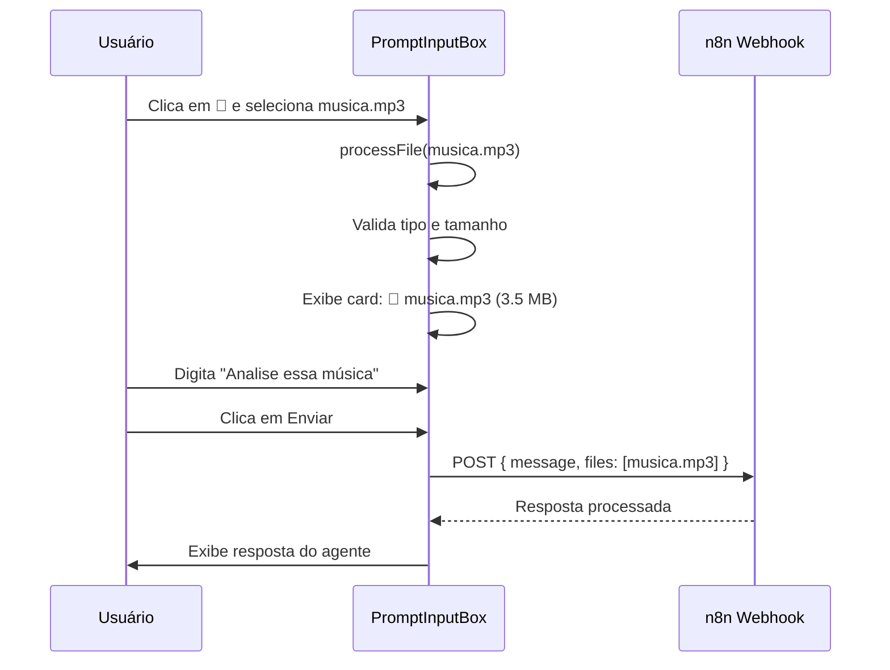
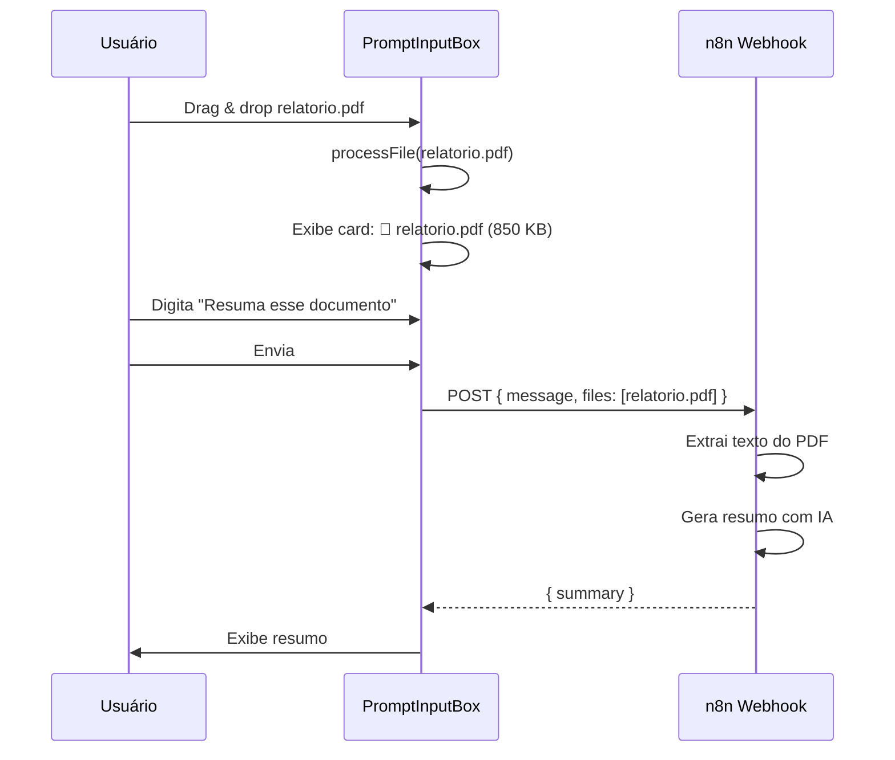
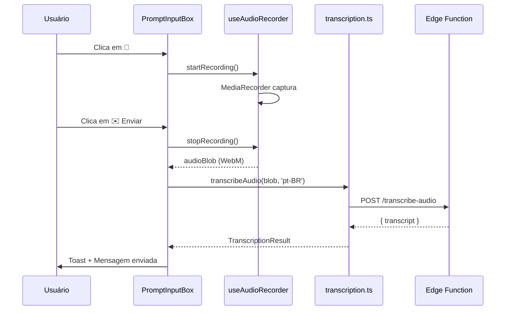

# Upload de Arquivos (Imagens, Áudio, Documentos)

## 📋 Resumo

Implementação completa da funcionalidade de upload de múltiplos tipos de arquivo através do botão Paperclip (📎), incluindo imagens, áudio e documentos. Arquivos são enviados como anexos para o webhook n8n processar conforme necessário.

**Status:** ✅ Implementado  
**Data:** 31 de Dezembro de 2025

---

## 🎯 Objetivo

Permitir que usuários façam upload de diferentes tipos de arquivos no chat:
- **Imagens**: Para análise visual
- **Áudio**: Para o webhook n8n processar (transcrição, análise, etc)
- **Documentos**: Para análise de conteúdo textual (TXT, PDF, Markdown)

---

## 🎨 Funcionalidades Implementadas

### 1. Upload de Múltiplos Tipos de Arquivo

O botão Paperclip (📎) aceita:

**Imagens**:
- JPEG, PNG, GIF, WebP
- Limite: 10MB
- Preview visual antes de enviar
- Análise via IA

**Áudio**:
- MP3 (`.mp3`, `audio/mpeg`)
- WAV (`.wav`, `audio/wav`, `audio/wave`)
- FLAC (`.flac`, `audio/flac`)
- OGG (`.ogg`, `audio/ogg`)
- WebM (`.webm`, `audio/webm`)
- M4A (`.m4a`, `audio/mp4`, `audio/x-m4a`)
- AAC (`.aac`, `audio/aac`)
- Limite: 25MB
- **Enviado como anexo** para webhook n8n processar
- **SEM transcrição automática** (n8n faz isso)

**Documentos** (novo):
- TXT (`.txt`, `text/plain`)
- PDF (`.pdf`, `application/pdf`)
- Markdown (`.md`, `.markdown`, `text/markdown`)
- Limite: 25MB
- Enviado como anexo para análise

### 2. Tratamento de Arquivos

**Imagens:**
- Preview visual (thumbnail)
- Enviadas junto com mensagem

**Áudio e Documentos:**
- Card com ícone (🎵 para áudio, 📄 para documento)
- Nome do arquivo e tamanho em KB
- Botão X para remover
- Enviados como anexos no payload

### 3. Fluxo de Envio

1. **Usuário seleciona arquivo** (clique ou drag & drop)
2. **Validação de tipo** (imagem/áudio/documento)
3. **Validação de tamanho** (10MB ou 25MB)
4. **Preview/Card** exibido no chat
5. **Usuário digita mensagem** (opcional)
6. **Envia mensagem + arquivo(s)**
7. **Webhook n8n recebe** payload com arquivo
8. **n8n processa** conforme necessário (transcrição, OCR, análise)

---

## 🔧 Arquitetura

### Frontend (`src/components/chat/PromptInputBox.tsx`)

#### Funções de Detecção de Tipo
```typescript
const isImageFile = (file: File) => file.type.startsWith("image/");

const isAudioFile = (file: File) => {
  const audioTypes = [
    'audio/mpeg', 'audio/mp3', 'audio/wav', 'audio/wave',
    'audio/x-wav', 'audio/flac', 'audio/x-flac', 'audio/ogg',
    'audio/webm', 'audio/mp4', 'audio/x-m4a', 'audio/aac',
  ];
  return file.type.startsWith('audio/') || audioTypes.includes(file.type);
};

const isDocumentFile = (file: File) => {
  const documentTypes = ['text/plain', 'text/markdown', 'application/pdf'];
  const documentExtensions = ['.txt', '.md', '.markdown', '.pdf'];
  const hasValidType = documentTypes.includes(file.type);
  const hasValidExtension = documentExtensions.some(ext => 
    file.name.toLowerCase().endsWith(ext)
  );
  return hasValidType || hasValidExtension;
};

const isSupportedFile = (file: File) => {
  return isImageFile(file) || isAudioFile(file) || isDocumentFile(file);
};
```

#### Função `processFile()` (simplificada)
```typescript
const processFile = React.useCallback((file: File) => {
  // Validar tipo
  if (!isSupportedFile(file)) {
    toast.error('Tipo não suportado');
    return;
  }

  // Validar tamanho
  const maxSize = isImageFile(file) ? 10 * 1024 * 1024 : 25 * 1024 * 1024;
  if (file.size > maxSize) {
    toast.error(`Arquivo muito grande`);
    return;
  }

  // Adicionar aos anexos
  setFiles([file]);
  
  // Preview apenas para imagens
  if (isImageFile(file)) {
    const reader = new FileReader();
    reader.onload = (e) => setFilePreviews({ [file.name]: e.target?.result as string });
    reader.readAsDataURL(file);
  } else {
    setFilePreviews({});
  }

  // Toast de confirmação
  const fileType = isImageFile(file) ? 'Imagem' : 
                   isAudioFile(file) ? 'Áudio' : 'Documento';
  toast.success(`${fileType} adicionado: ${file.name}`);
}, [setFiles, setFilePreviews]);
```

**Mudanças Principais:**
- ❌ **Removida transcrição automática** de áudio
- ✅ **Arquivos tratados como anexos** normais
- ✅ **Suporte para documentos** (TXT, PDF, MD)
- ✅ **Preview apenas para imagens**
- ✅ **Card com ícone** para áudio/documentos

#### Visualização de Arquivos

**Imagens:**
```tsx
<div className="w-16 h-16 rounded-xl overflow-hidden">
  
  <button onClick={handleRemove}>✕</button>
</div>
```

**Áudio/Documentos:**
```tsx
<div className="flex items-center gap-2 px-3 py-2 bg-gray-800/50">
  <span>{isAudioFile(file) ? '🎵' : '📄'}</span>
  <div>
    <p className="text-sm">{file.name}</p>
    <p className="text-xs">{(file.size / 1024).toFixed(1)} KB</p>
  </div>
  <button onClick={handleRemove}>✕</button>
</div>
```

#### Input de Upload
```tsx
<input
  type="file"
  accept="image/*,audio/*,.mp3,.wav,.m4a,.flac,.ogg,.webm,.aac,.txt,.pdf,.md,.markdown"
  onChange={(e) => processFile(e.target.files[0])}
/>
```

---

## 🚀 Integração com Webhook n8n

### Payload Enviado

Quando o usuário envia uma mensagem com arquivo anexo, o payload para o webhook n8n contém:

```json
{
  "message": "Texto da mensagem (opcional)",
  "files": [
    {
      "name": "audio.mp3",
      "type": "audio/mpeg",
      "size": 1024000,
      "data": "..." // Base64 ou URL dependendo da implementação
    }
  ]
}
```

### Processamento no n8n

O webhook n8n pode:
1. **Para áudio**: Chamar Google Speech-to-Text, Whisper, ou outro serviço
2. **Para PDF**: Extrair texto com PDF parser
3. **Para imagens**: OCR, análise visual, etc
4. **Para TXT/MD**: Análise de conteúdo, embeddings, etc

**Vantagens:**
- ✅ Flexibilidade total no processamento
- ✅ Não processa música como transcrição
- ✅ Permite diferentes estratégias por tipo de arquivo
- ✅ Logs centralizados no n8n
- ✅ Retry automático em caso de erro

---

## 📊 Fluxo de Uso

### Cenário 1: Upload de Arquivo MP3 (Música)



### Cenário 2: Upload de Documento PDF



### Cenário 3: Gravação em Tempo Real (Mantido)



---

## 🧪 Como Testar

### 1. Preparar Ambiente
```bash
npm run dev
```

### 2. Testar Upload de Áudio

**Arquivos de teste:**
- ✅ **MP3** (música ou voz)
- ✅ **WAV**
- ⚠️ **M4A** (pode ter problemas de MIME type)

**Passos:**
1. Abrir chat de IA
2. Clicar no ícone 📎 (Paperclip)
3. Selecionar arquivo de áudio
4. Ver card com 🎵, nome e tamanho
5. Digitar mensagem (ex: "Transcreva isso")
6. Clicar em Enviar
7. Arquivo é enviado para webhook n8n

### 3. Testar Upload de Documento

**Formatos:**
- ✅ **TXT** - Texto simples
- ✅ **PDF** - Documento
- ✅ **MD** - Markdown

**Passos:**
1. Drag & drop arquivo .pdf na área do chat
2. Ver card com 📄, nome e tamanho
3. Escrever instrução (ex: "Analise esse PDF")
4. Enviar

### 4. Testar Gravação (Mantido)

1. Clicar no ícone 🎤 (Microfone)
2. Permitir acesso ao microfone
3. Falar claramente
4. Clicar em ✉️ (Enviar)
5. Ver transcrição via Google API
6. Mensagem enviada automaticamente

### 5. Testar Validações

**Arquivo muito grande (>25MB):**
```
Toast: "Arquivo muito grande (máx. 25MB)"
```

**Tipo não suportado (.exe, .zip):**
```
Toast: "Tipo de arquivo não suportado. Use: imagens, áudio, documentos"
```

**Remover arquivo:**
- Clicar no X no card
- Card desaparece
- Arquivo removido dos anexos

---

## 🐛 Troubleshooting

### Arquivo não é aceito

**Causa:** Tipo MIME não detectado corretamente

**Solução:**
- Verificar extensão: `.mp3`, `.wav`, `.pdf`, `.txt`, `.md`
- Tentar renomear arquivo com extensão correta
- Verificar se arquivo não está corrompido

### Card não aparece para áudio/documento

**Causa:** Apenas imagens têm preview visual

**Solução:**
- Para áudio: Deve aparecer card com 🎵
- Para documentos: Deve aparecer card com 📄
- Se não aparecer, verificar console para erros

### Arquivo não é enviado para webhook

**Causa:** Webhook n8n não configurado ou indisponível

**Solução:**
1. Verificar `VITE_N8N_WEBHOOK_URL` em `.env`
2. Testar webhook manualmente com curl
3. Verificar logs do n8n
4. Verificar CORS do webhook

### Gravação por voz não funciona (Edge Function)

**Causa:** `GOOGLE_SPEECH_API_KEY` não configurada

**Solução:**
1. Acessar [Supabase Dashboard](https://supabase.com/dashboard)
2. Ir em **Settings → Edge Functions**
3. Adicionar variável: `GOOGLE_SPEECH_API_KEY=AIza...`
4. Aguardar ~2 minutos para propagação

---

## 📈 Melhorias Futuras

### Backend
- [ ] Suporte a M4A/AAC (conversão no backend)
- [ ] Compressão automática de arquivos grandes
- [ ] Upload para Supabase Storage antes de enviar para webhook
- [ ] Geração de thumbnails para PDFs

### Frontend
- [ ] Preview de PDF inline
- [ ] Player de áudio inline
- [ ] Múltiplos arquivos simultâneos
- [ ] Barra de progresso durante upload
- [ ] Drag & drop visual melhorado

### UX
- [ ] Atalho de teclado Ctrl+U para upload
- [ ] Copiar/colar arquivos do clipboard
- [ ] Histórico de arquivos enviados
- [ ] Categorização automática por tipo

---

## 📚 Referências

### Documentação Google Cloud
- [Speech-to-Text API v1](https://cloud.google.com/speech-to-text/docs/reference/rest/v1/speech/recognize)
- [Supported Encodings](https://cloud.google.com/speech-to-text/docs/encoding)
- [Best Practices](https://cloud.google.com/speech-to-text/docs/best-practices)
- [Pricing Calculator](https://cloud.google.com/speech-to-text/pricing)

### Arquivos Modificados
- ✅ `src/components/chat/PromptInputBox.tsx` - Upload multi-formato
- ✅ `docs/features/AUDIO_FILE_UPLOAD_TRANSCRIPTION.md` - Documentação atualizada

### Documentação Relacionada
- [AUDIO_TRANSCRIPTION_GOOGLE.md](./AUDIO_TRANSCRIPTION_GOOGLE.md) - Setup Google API (gravação)
- [AUDIO_TRANSCRIPTION_BUGFIXES.md](./AUDIO_TRANSCRIPTION_BUGFIXES.md) - Correções v2.1.1
- [AUDIO_TRANSCRIPTION_QUICKSTART.md](./AUDIO_TRANSCRIPTION_QUICKSTART.md) - Guia rápido

---

## ✅ Checklist de Validação

- [x] Função `isAudioFile()` detecta todos os formatos
- [x] Função `isDocumentFile()` detecta TXT, PDF, MD
- [x] Função `isSupportedFile()` valida tipos aceitos
- [x] Função `processFile()` trata todos os tipos sem transcrição automática
- [x] Validação de tamanho (10MB imagem, 25MB outros)
- [x] Preview visual apenas para imagens
- [x] Card com ícone para áudio (🎵) e documentos (📄)
- [x] Toast informativo ao adicionar arquivo
- [x] Input aceita: `image/*,audio/*,text/*,.pdf,.md`
- [x] Drag & drop funciona para todos os tipos
- [x] Arquivos enviados como anexos no `onSend(message, files)`
- [x] Sem erros de compilação
- [x] Gravação por voz mantida (usa Edge Function)
- [x] Documentação completa atualizada

---

**Status Final:** ✅ **IMPLEMENTAÇÃO COMPLETA E FUNCIONAL**

A funcionalidade de upload de arquivos está totalmente implementada para **imagens, áudio e documentos**. Arquivos de áudio **NÃO são transcritos automaticamente** no frontend - eles são enviados como anexos para o webhook n8n processar conforme necessário (transcrição, análise, etc). A gravação por voz em tempo real continua funcionando normalmente usando a Edge Function `transcribe-audio`.
