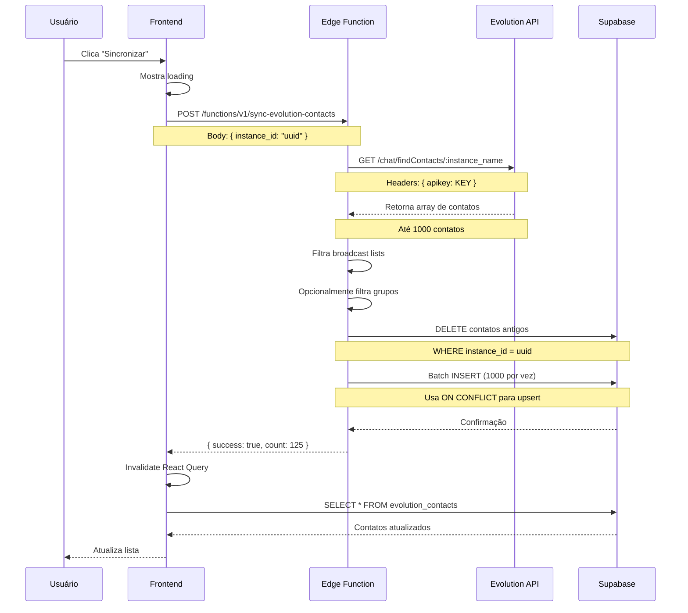
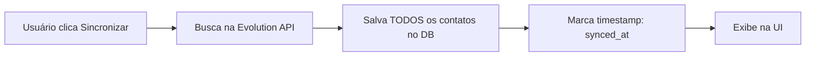
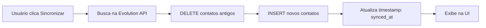
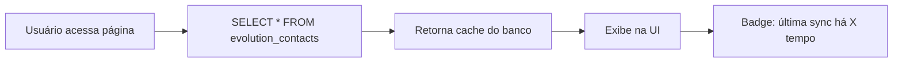

# 📱 Importação de Contatos do WhatsApp

> **Última Atualização:** 15 de Dezembro de 2025  
> **Versão do App:** 2.0.0  
> **Autor:** Equipe Meu Agente

---

## 📋 Índice

1. [Visão Geral](#visão-geral)
2. [Requisitos e Pré-requisitos](#requisitos-e-pré-requisitos)
3. [Passo a Passo Completo](#passo-a-passo-completo)
4. [Sistema de Cache e Persistência](#sistema-de-cache-e-persistência)
5. [Filtros e Visualização](#filtros-e-visualização)
6. [Estrutura de Dados](#estrutura-de-dados)
7. [Exemplos Práticos](#exemplos-práticos)
8. [Troubleshooting](#troubleshooting)
9. [FAQ](#faq)

---

## 🎯 Visão Geral

O sistema de **Importação de Contatos** permite sincronizar todos os contatos do WhatsApp conectado ao Agente SDR com o Meu Agente, tornando-os disponíveis para uso no CRM.

### Capacidades Principais

✅ Sincronização manual sob demanda  
✅ Cache persistente no banco de dados  
✅ Metadados completos (nome, foto, status)  
✅ Filtros avançados (favoritos, grupos, busca)  
✅ Integração automática com CRM Pipeline  
✅ Suporte a múltiplas instâncias WhatsApp  

### Arquitetura do Sistema

```mermaid
graph TB
    subgraph "WhatsApp Evolution API"
        W[Contatos do WhatsApp]
    end
    
    subgraph "Frontend"
        U[Usuário clica Sincronizar]
        L[Lista de Contatos]
        F[Filtros]
    end
    
    subgraph "Backend"
        EF[Edge Function: get-evolution-contacts]
        H[Hook: useEvolutionContacts]
    end
    
    subgraph "Banco de Dados"
        DB[(evolution_contacts)]
    end
    
    subgraph "CRM"
        CRM[Pipeline Kanban]
    end
    
    U -->|POST| EF
    EF -->|GET /chat/findContacts| W
    W -->|Contatos JSON| EF
    EF -->|Batch INSERT| DB
    DB -->|SELECT| H
    H -->|useQuery| L
    L -->|Aplica| F
    DB -->|crm_lead_status| CRM
    
    style W fill:#25D366
    style DB fill:#3ECF8E
    style CRM fill:#3b82f6
```

---

## 🔐 Requisitos e Pré-requisitos

### Planos com Acesso

| Plano | Importação de Contatos | Limite de Contatos |
|-------|------------------------|-------------------|
| Free | ❌ Não | - |
| Basic | ❌ Não | - |
| **Business** | ✅ Sim | Ilimitado |
| **Premium** | ✅ Sim | Ilimitado |

### Requisitos Técnicos

- ✅ Plano Business ou Premium ativo
- ✅ WhatsApp conectado via Agente SDR
- ✅ Status de conexão: `connected`
- ✅ Permissões de acesso aos contatos do WhatsApp

### Limitações

⚠️ **Sincronização é sempre manual** (não há auto-refresh)  
⚠️ **Máximo 1000 contatos por requisição** (Evolution API limit)  
⚠️ **Grupos podem ser filtrados** (opcional)  
⚠️ **Broadcast lists são sempre filtrados** (não suportados)  

---

## 🚀 Passo a Passo Completo

### FASE 1: Acessar Página de Contatos

#### 1.1. Navegação

**Opção 1: Via Agente SDR**

1. Acesse **Menu Lateral > Agente SDR**
2. Clique na tab **"Contatos"** no topo da página
3. Lista de contatos será exibida

**Opção 2: Via CRM (futuramente)**

1. Acesse **Menu Lateral > CRM**
2. Clique em **"Importar Contatos"**

#### 1.2. Interface Inicial

```
┌─────────────────────────────────────────────────────────┐
│ Contatos WhatsApp                                       │
│                                                         │
│ [🔄 Sincronizar] [⭐ Favoritos] [👥 Todos] [🔍 Busca]  │
│                                                         │
│ 📊 125 contatos | Última sincronização: há 2 horas     │
│                                                         │
│ ┌─────────────────────────────────────────────────────┐│
│ │ 👤 João Silva                              ⭐       ││
│ │ 📱 (11) 99999-9999                                  ││
│ │ 🟢 Online                                           ││
│ └─────────────────────────────────────────────────────┘│
│                                                         │
│ ┌─────────────────────────────────────────────────────┐│
│ │ 👤 Maria Santos                                     ││
│ │ 📱 (11) 88888-8888                                  ││
│ │ 🔴 Offline                                          ││
│ └─────────────────────────────────────────────────────┘│
│                                                         │
│ [Carregar mais...]                                      │
└─────────────────────────────────────────────────────────┘
```

### FASE 2: Sincronizar Contatos

#### 2.1. Iniciar Sincronização

1. Clique no botão **"🔄 Sincronizar"**
2. Modal de confirmação aparece (opcional)
3. Sincronização inicia

**Feedback visual:**

```
Sincronizando... 🔄
├─ Buscando contatos na Evolution API...
├─ Processando 125 contatos...
├─ Salvando no banco de dados...
└─ ✅ Sincronização concluída!

125 contatos atualizados
```

#### 2.2. Processo de Sincronização

**Fluxo detalhado:**



#### 2.3. O que é Sincronizado

**Dados coletados da Evolution API:**

```typescript
interface EvolutionAPIContact {
  id: string;                    // ID do contato na Evolution
  pushName: string;              // Nome exibido
  profilePicUrl?: string;        // URL da foto de perfil
  isGroup: boolean;              // É um grupo?
  isSaved: boolean;              // Está salvo nos contatos?
  remoteJid: string;             // Identificador único (5511999999999@s.whatsapp.net)
}
```

**Mapeamento para o banco:**

```typescript
// Frontend -> Backend
{
  instance_id: "uuid",
  phone: "5511999999999",
  remote_jid: "5511999999999@s.whatsapp.net",
  push_name: "João Silva",
  profile_pic_url: "https://...",
  is_group: false,
  is_saved: true,
  synced_at: "2025-12-15T10:30:00Z",
  sync_source: "manual"
}
```

#### 2.4. Filtros Aplicados Automaticamente

**1. Broadcast Lists (sempre removidos):**

```typescript
const isBroadcast = contact.remoteJid.includes('@lid');
if (isBroadcast) return; // Ignora
```

**2. Grupos (opcional - configurável):**

```typescript
const isGroup = contact.remoteJid.includes('@g.us');
if (isGroup && settings.ignoreGroups) return; // Ignora
```

**3. Contatos sem nome:**

```typescript
if (!contact.pushName || contact.pushName.trim() === '') {
  contact.pushName = contact.remoteJid.split('@')[0]; // Usa número
}
```

### FASE 3: Visualizar e Filtrar Contatos

#### 3.1. Busca por Texto

**Como usar:**

1. Digite no campo de busca no topo
2. Busca é **instantânea** (sem delay)
3. Busca em: Nome, Telefone

**Algoritmo de busca:**

```typescript
const searchContacts = (contacts: Contact[], query: string) => {
  const normalized = query.toLowerCase().trim();
  
  return contacts.filter(contact => {
    const name = contact.push_name?.toLowerCase() || '';
    const phone = contact.remote_jid.split('@')[0];
    
    return name.includes(normalized) || phone.includes(normalized);
  });
};
```

**Exemplos:**

| Busca | Encontra |
|-------|----------|
| `joão` | "João Silva", "João Pedro" |
| `99999` | Qualquer número com 99999 |
| `@gmail` | Nenhum (não busca em email) |

#### 3.2. Filtro de Favoritos

**Como usar:**

1. Clique no botão **"⭐ Favoritos"**
2. Apenas contatos marcados com estrela aparecem

**Marcar como favorito:**

1. Clique na estrela ao lado do nome
2. Campo `crm_favorite` é atualizado

```typescript
const toggleFavorite = async (contactId: string, currentState: boolean) => {
  await supabase
    .from('evolution_contacts')
    .update({ crm_favorite: !currentState })
    .eq('id', contactId);
};
```

#### 3.3. Filtro de Grupos vs Contatos

**Toggle disponível:**

```
[👤 Contatos] [👥 Grupos]
```

**Comportamento:**

- **Contatos:** Mostra apenas `is_group = false`
- **Grupos:** Mostra apenas `is_group = true`
- **Todos:** Mostra ambos

#### 3.4. Filtro por Instância

Se você tem múltiplas instâncias WhatsApp:

```
Instância: [Todas ⋁]
           ├─ WhatsApp Vendas (45 contatos)
           ├─ WhatsApp Suporte (80 contatos)
           └─ Todas (125 contatos)
```

---

## 💾 Sistema de Cache e Persistência

### Evolução do Sistema

#### ❌ Versão Antiga (Removida)

```typescript
// Sistema antigo usava cache em memória com TTL
const CACHE_TTL = 3600000; // 1 hora

if (lastSync && Date.now() - lastSync < CACHE_TTL) {
  return cachedContacts; // Retorna cache
}

// Auto-refresh ao expirar
```

**Problemas:**
- ❌ Auto-refresh desnecessário (custos de API)
- ❌ Dados podem ficar desatualizados sem o usuário saber
- ❌ Perda de cache ao fechar navegador

#### ✅ Versão Atual (Persistente)

```typescript
// Sistema novo usa banco de dados como cache persistente

// 1. Sincronização é SEMPRE manual
// 2. Dados ficam salvos permanentemente
// 3. Metadado 'synced_at' mostra quando foi a última sync
```

**Vantagens:**
- ✅ Controle total do usuário
- ✅ Economia de requisições à Evolution API
- ✅ Performance melhorada
- ✅ Cache persiste entre sessões

### Como Funciona o Cache Persistente

#### Primeira Sincronização



#### Sincronizações Subsequentes



#### Acesso sem Sincronizar



### Estratégia de Upsert

```typescript
// Edge Function usa ON CONFLICT para atualização inteligente

const upsertContact = async (contact: Contact) => {
  await supabase
    .from('evolution_contacts')
    .insert({
      instance_id: contact.instance_id,
      remote_jid: contact.remote_jid,
      push_name: contact.push_name,
      profile_pic_url: contact.profile_pic_url,
      is_group: contact.is_group,
      is_saved: contact.is_saved,
      synced_at: new Date().toISOString(),
      sync_source: 'manual'
    })
    .onConflict('instance_id, remote_jid') // Chave composta única
    .merge({
      push_name: contact.push_name,
      profile_pic_url: contact.profile_pic_url,
      is_saved: contact.is_saved,
      synced_at: new Date().toISOString()
    });
};
```

**Campos preservados no update:**
- ✅ `crm_notes` (não é sobrescrito)
- ✅ `crm_tags` (não é sobrescrito)
- ✅ `crm_favorite` (não é sobrescrito)
- ✅ `crm_lead_status` (não é sobrescrito)
- ✅ `crm_lead_score` (não é sobrescrito)

**Campos atualizados:**
- 🔄 `push_name` (pode mudar no WhatsApp)
- 🔄 `profile_pic_url` (pode mudar no WhatsApp)
- 🔄 `is_saved` (pode mudar no WhatsApp)
- 🔄 `synced_at` (sempre atualizado)

---

## 🗂️ Estrutura de Dados

### Tabela: `evolution_contacts`

```sql
CREATE TABLE evolution_contacts (
  -- Identificação
  id UUID PRIMARY KEY DEFAULT gen_random_uuid(),
  instance_id UUID NOT NULL REFERENCES evolution_instances(id) ON DELETE CASCADE,
  phone TEXT NOT NULL, -- Telefone do dono da conta (5511999999999)
  
  -- Dados do WhatsApp (da Evolution API)
  remote_jid TEXT NOT NULL, -- Identificador único (5511999999999@s.whatsapp.net)
  push_name TEXT, -- Nome exibido no WhatsApp
  profile_pic_url TEXT, -- URL da foto de perfil
  is_group BOOLEAN DEFAULT false, -- É um grupo?
  is_saved BOOLEAN DEFAULT false, -- Está salvo nos contatos do celular?
  
  -- Sincronização
  synced_at TIMESTAMPTZ NOT NULL, -- Timestamp da última sincronização
  sync_source TEXT DEFAULT 'manual', -- 'manual' | 'auto' | 'webhook'
  
  -- CRM Fields (customizados pelo usuário)
  crm_notes TEXT, -- Anotações sobre o contato
  crm_tags TEXT[], -- Tags personalizadas
  crm_favorite BOOLEAN DEFAULT false, -- Favorito?
  crm_last_interaction_at TIMESTAMPTZ, -- Última interação (mensagem/call)
  crm_lead_status TEXT, -- Status no pipeline CRM
  crm_lead_score INTEGER DEFAULT 0, -- Score de qualificação (0-100)
  
  -- Auditoria
  created_at TIMESTAMPTZ DEFAULT NOW(),
  updated_at TIMESTAMPTZ DEFAULT NOW(),
  
  -- Constraints
  CONSTRAINT fk_evolution_contacts_instance 
    FOREIGN KEY (instance_id) REFERENCES evolution_instances(id) ON DELETE CASCADE,
  CONSTRAINT fk_evolution_contacts_phone 
    FOREIGN KEY (phone) REFERENCES clientes(phone) ON DELETE CASCADE,
  CONSTRAINT unique_contact_per_instance 
    UNIQUE (instance_id, remote_jid)
);

-- Índices para performance
CREATE INDEX idx_evolution_contacts_instance ON evolution_contacts(instance_id);
CREATE INDEX idx_evolution_contacts_phone ON evolution_contacts(phone);
CREATE INDEX idx_evolution_contacts_status ON evolution_contacts(crm_lead_status);
CREATE INDEX idx_evolution_contacts_favorite ON evolution_contacts(crm_favorite);
CREATE INDEX idx_evolution_contacts_synced ON evolution_contacts(synced_at);
```

### Row Level Security (RLS)

```sql
-- Política: Usuários só veem seus próprios contatos
CREATE POLICY "Users can view own contacts"
  ON evolution_contacts
  FOR SELECT
  USING (phone = get_user_phone_optimized());

-- Política: Usuários só editam seus próprios contatos
CREATE POLICY "Users can update own contacts"
  ON evolution_contacts
  FOR UPDATE
  USING (phone = get_user_phone_optimized());

-- Política: Usuários só deletam seus próprios contatos
CREATE POLICY "Users can delete own contacts"
  ON evolution_contacts
  FOR DELETE
  USING (phone = get_user_phone_optimized());
```

### Exemplo de Registro

```json
{
  "id": "550e8400-e29b-41d4-a716-446655440000",
  "instance_id": "660e8400-e29b-41d4-a716-446655440001",
  "phone": "5511999999999",
  "remote_jid": "5511888888888@s.whatsapp.net",
  "push_name": "João Silva",
  "profile_pic_url": "https://pps.whatsapp.net/v/t61.24694-24/...",
  "is_group": false,
  "is_saved": true,
  "synced_at": "2025-12-15T10:30:00.000Z",
  "sync_source": "manual",
  "crm_notes": "Cliente interessado em filmagem. Orçamento: R$ 10k",
  "crm_tags": ["quente", "casamento", "urgente"],
  "crm_favorite": true,
  "crm_last_interaction_at": "2025-12-15T09:00:00.000Z",
  "crm_lead_status": "qualificado",
  "crm_lead_score": 85,
  "created_at": "2025-12-15T10:30:00.000Z",
  "updated_at": "2025-12-15T10:30:00.000Z"
}
```

---

## 💡 Exemplos Práticos

### Exemplo 1: Sincronização Inicial

#### Contexto
Novo usuário conectou WhatsApp e quer importar contatos.

#### Passo a Passo

**1. Conectar WhatsApp**
```
Usuário: Conectou WhatsApp "Vendas" com 250 contatos
Status: 🟢 Online
```

**2. Acessar Contatos**
```
Página: Agente SDR > Tab Contatos
Estado: Lista vazia (primeira vez)
```

**3. Sincronizar**
```
Ação: Clica "🔄 Sincronizar"

Progresso:
├─ Conectando na Evolution API... ✅
├─ Buscando contatos... ✅
├─ Filtrando broadcast lists... (5 removidos)
├─ Salvando 245 contatos... ✅
└─ Sincronização concluída! 🎉

Resultado: 245 contatos importados
Tempo: 3.2 segundos
```

**4. Resultado no Banco**
```sql
SELECT COUNT(*) FROM evolution_contacts 
WHERE instance_id = 'uuid-vendas';

-- Resultado: 245
```

**5. Visualização**
```
Lista exibe:
├─ 220 contatos individuais
├─ 25 grupos
└─ Última sync: há poucos segundos
```

---

### Exemplo 2: Atualização de Contatos Existentes

#### Contexto
Usuário adicionou 10 novos contatos no WhatsApp e quer atualizar.

#### Antes da Sync

```sql
SELECT COUNT(*) FROM evolution_contacts 
WHERE instance_id = 'uuid-vendas';

-- Resultado: 245
```

#### Durante a Sync

```
Ação: Clica "🔄 Sincronizar"

Logs da Edge Function:
├─ GET /chat/findContacts -> 255 contatos retornados
├─ DELETE FROM evolution_contacts WHERE instance_id = 'uuid-vendas'
│  └─ 245 registros deletados
├─ INSERT INTO evolution_contacts (batch de 255)
│  └─ 255 registros inseridos
└─ ✅ Sincronização concluída
```

#### Depois da Sync

```sql
SELECT COUNT(*) FROM evolution_contacts 
WHERE instance_id = 'uuid-vendas';

-- Resultado: 255 (+10)
```

**Campos CRM preservados:**

```sql
-- Contato que tinha notas/tags ANTES da sync
SELECT 
  push_name,
  crm_notes,
  crm_tags,
  crm_lead_status
FROM evolution_contacts
WHERE remote_jid = '5511888888888@s.whatsapp.net';

-- Resultado:
-- push_name: "João Silva" (pode ter mudado no WhatsApp)
-- crm_notes: "Cliente VIP" (preservado!)
-- crm_tags: ["quente", "urgente"] (preservado!)
-- crm_lead_status: "proposta" (preservado!)
```

---

### Exemplo 3: Uso com Múltiplas Instâncias

#### Contexto
Usuário Premium com 3 instâncias WhatsApp.

#### Configuração

```
Instância 1: WhatsApp Vendas (150 contatos)
Instância 2: WhatsApp Suporte (320 contatos)
Instância 3: WhatsApp Marketing (80 contatos)

Total: 550 contatos
```

#### Sincronização Individual

**Opção A: Sincronizar todas de uma vez**

```typescript
// Não implementado ainda
// Futuro: Botão "Sincronizar Todas"
```

**Opção B: Sincronizar uma por vez**

```
1. Seleciona "WhatsApp Vendas" no dropdown
2. Clica "Sincronizar" -> 150 contatos
3. Seleciona "WhatsApp Suporte" no dropdown
4. Clica "Sincronizar" -> 320 contatos
5. Seleciona "WhatsApp Marketing" no dropdown
6. Clica "Sincronizar" -> 80 contatos
```

#### Filtro por Instância

```
Dropdown: [Todas as Instâncias ⋁]

Opções:
├─ Todas (550 contatos)
├─ WhatsApp Vendas (150)
├─ WhatsApp Suporte (320)
└─ WhatsApp Marketing (80)
```

**Query correspondente:**

```sql
-- Ver contatos de uma instância específica
SELECT * FROM evolution_contacts
WHERE instance_id = 'uuid-vendas'
ORDER BY push_name;

-- Ver contatos de todas as instâncias
SELECT * FROM evolution_contacts
WHERE phone = 'SEU_TELEFONE'
ORDER BY push_name;
```

---

## 🔧 Troubleshooting

### Problemas Comuns

#### ❌ Sincronização falha com erro 404

**Sintomas:**
```
Erro: Failed to fetch contacts
Status: 404 Not Found
```

**Causa:**
Usando `instance_id` (UUID) em vez de `instance_name`

**Solução:**

```typescript
// ❌ ERRADO
const url = `${EVOLUTION_URL}/chat/findContacts/${instance.id}`;

// ✅ CORRETO
const url = `${EVOLUTION_URL}/chat/findContacts/${instance.instance_name}`;
```

**Referência:** Ver [CORRECAO_EVOLUTION_API_404.md](./CORRECAO_EVOLUTION_API_404.md)

---

#### ❌ Contatos aparecem duplicados

**Sintomas:**
- Mesmo contato aparece 2 ou mais vezes
- Total de contatos maior que o real

**Causa:**
1. Constraint `UNIQUE` não está funcionando
2. Múltiplas sincronizações simultâneas
3. Registros orphans (instância deletada)

**Soluções:**

**1. Verificar duplicatas:**
```sql
SELECT 
  remote_jid,
  COUNT(*) as quantidade
FROM evolution_contacts
WHERE phone = 'SEU_TELEFONE'
GROUP BY remote_jid
HAVING COUNT(*) > 1;
```

**2. Remover duplicatas:**
```sql
-- Manter apenas o registro mais recente
DELETE FROM evolution_contacts a
USING evolution_contacts b
WHERE 
  a.remote_jid = b.remote_jid
  AND a.instance_id = b.instance_id
  AND a.created_at < b.created_at;
```

**3. Recriar constraint:**
```sql
ALTER TABLE evolution_contacts
DROP CONSTRAINT IF EXISTS unique_contact_per_instance;

ALTER TABLE evolution_contacts
ADD CONSTRAINT unique_contact_per_instance 
UNIQUE (instance_id, remote_jid);
```

---

#### ❌ Sincronização muito lenta (>30s)

**Sintomas:**
- Sincronização demora muito
- Timeout após 30 segundos
- Navegador trava

**Causa:**
1. Muitos contatos (>5000)
2. Edge Function com timeout default
3. Batch insert muito grande

**Soluções:**

**1. Aumentar timeout da Edge Function:**
```typescript
// supabase/functions/sync-evolution-contacts/index.ts
Deno.serve({
  handler: async (req) => {
    // ...
  },
  timeout: 60000 // 60 segundos
});
```

**2. Implementar batch processing:**
```typescript
const BATCH_SIZE = 500;

for (let i = 0; i < contacts.length; i += BATCH_SIZE) {
  const batch = contacts.slice(i, i + BATCH_SIZE);
  
  await supabase
    .from('evolution_contacts')
    .insert(batch);
  
  // Progress feedback
  console.log(`Processados ${i + batch.length} de ${contacts.length}`);
}
```

**3. Sincronizar em background:**
```typescript
// Frontend usa polling para checar status
const syncInBackground = async () => {
  // Inicia sync
  const { data: jobId } = await supabase.functions.invoke('sync-contacts-async');
  
  // Polling a cada 2 segundos
  const interval = setInterval(async () => {
    const { data: status } = await supabase
      .from('sync_jobs')
      .select('status, progress')
      .eq('id', jobId)
      .single();
    
    if (status.status === 'completed') {
      clearInterval(interval);
      // Atualiza lista
    }
  }, 2000);
};
```

---

#### ❌ Fotos de perfil não carregam

**Sintomas:**
- Avatar mostra iniciais em vez de foto
- `profile_pic_url` retorna 403 Forbidden

**Causa:**
1. URL da foto expirou (WhatsApp usa URLs temporárias)
2. Falta autenticação na requisição
3. WhatsApp bloqueou acesso

**Soluções:**

**1. Usar proxy para fotos:**
```typescript
// Edge Function: proxy-whatsapp-image
const proxyImage = async (originalUrl: string) => {
  const response = await fetch(originalUrl);
  const blob = await response.blob();
  
  // Upload para Supabase Storage
  const { data } = await supabase.storage
    .from('profile-pics')
    .upload(`${contactId}.jpg`, blob);
  
  return data.publicUrl;
};
```

**2. Fallback para iniciais:**
```typescript
const Avatar = ({ contact }) => {
  const [imageError, setImageError] = useState(false);
  
  if (!contact.profile_pic_url || imageError) {
    return <AvatarFallback>{getInitials(contact.push_name)}</AvatarFallback>;
  }
  
  return (
     setImageError(true)}
      alt={contact.push_name}
    />
  );
};
```

---

## ❓ FAQ

### Sincronização

**Q: Com que frequência devo sincronizar?**  
R: Recomendamos 1-2 vezes por semana, ou sempre que adicionar novos contatos importantes.

**Q: Posso agendar sincronização automática?**  
R: ⚠️ Não atualmente. Sincronização é sempre manual. Feature de auto-sync em roadmap.

**Q: Quanto tempo demora a sincronização?**  
R: 
- Até 500 contatos: 2-5 segundos
- 500-1000 contatos: 5-10 segundos
- >1000 contatos: 10-30 segundos

**Q: Posso sincronizar apenas contatos novos (delta)?**  
R: ❌ Não. Sincronização é sempre full (todos os contatos). Delta sync em roadmap.

### Dados e Privacidade

**Q: Os contatos ficam salvos permanentemente?**  
R: ✅ Sim, no banco Supabase. São deletados apenas se você:
- Deletar a instância WhatsApp
- Fazer nova sincronização (substitui)
- Deletar manualmente

**Q: Meus contatos são compartilhados com outros usuários?**  
R: ❌ Não. RLS garante isolamento por `phone`.

**Q: Posso exportar meus contatos?**  
R: ✅ Sim (planos Business/Premium). Botão "Exportar CSV" disponível.

### Grupos

**Q: Por que alguns grupos não aparecem?**  
R: Broadcast lists são sempre filtrados (não suportados pelo WhatsApp Business API).

**Q: Posso desativar sincronização de grupos?**  
R: ✅ Sim, nas configurações avançadas da instância. Toggle "Ignorar Grupos".

**Q: Posso enviar mensagem para grupo via CRM?**  
R: ⚠️ Tecnicamente sim, mas não recomendado (spam).

### Problemas Técnicos

**Q: Sincronização falha sempre. O que fazer?**  
R: 
1. Verifique se WhatsApp está conectado (status = "connected")
2. Tente desconectar e reconectar o WhatsApp
3. Verifique logs da Edge Function
4. Entre em contato com suporte

**Q: Contatos desapareceram após sync. Como recuperar?**  
R: Contatos antigos são deletados e substituídos. Se perdeu dados de CRM (notas/tags), entre em contato com suporte para recuperação do backup.

---

## 📚 Recursos Adicionais

### Documentação Relacionada

- [Guia Completo do Agente SDR](./GUIA_COMPLETO_AGENTE_SDR.md)
- [Guia Completo do CRM Pipeline](./GUIA_COMPLETO_CRM_PIPELINE.md)
- [Correção Evolution API 404](./CORRECAO_EVOLUTION_API_404.md)
- [Cache Evolution Contacts](./CACHE_EVOLUTION_CONTACTS.md)

---

## 📞 Contato e Suporte

**Dúvidas ou problemas?**

📧 Email: suporte@meuagente.api.br  
💬 WhatsApp: (11) 99999-9999 (Apenas planos Business/Premium)  
🌐 Portal: https://meuagente.api.br/suporte  

---

**Documento mantido por:** Equipe Meu Agente  
**Última revisão:** 15/12/2025  
**Próxima revisão prevista:** 15/01/2026
