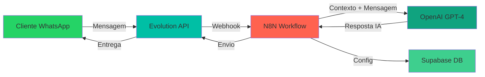
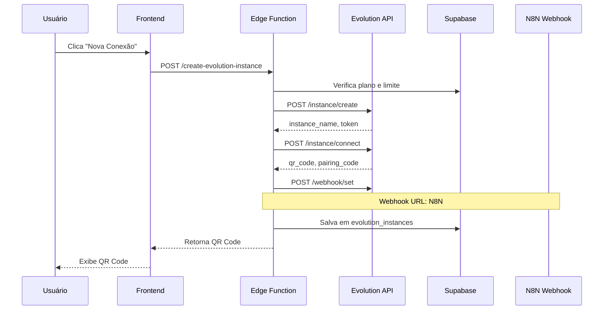
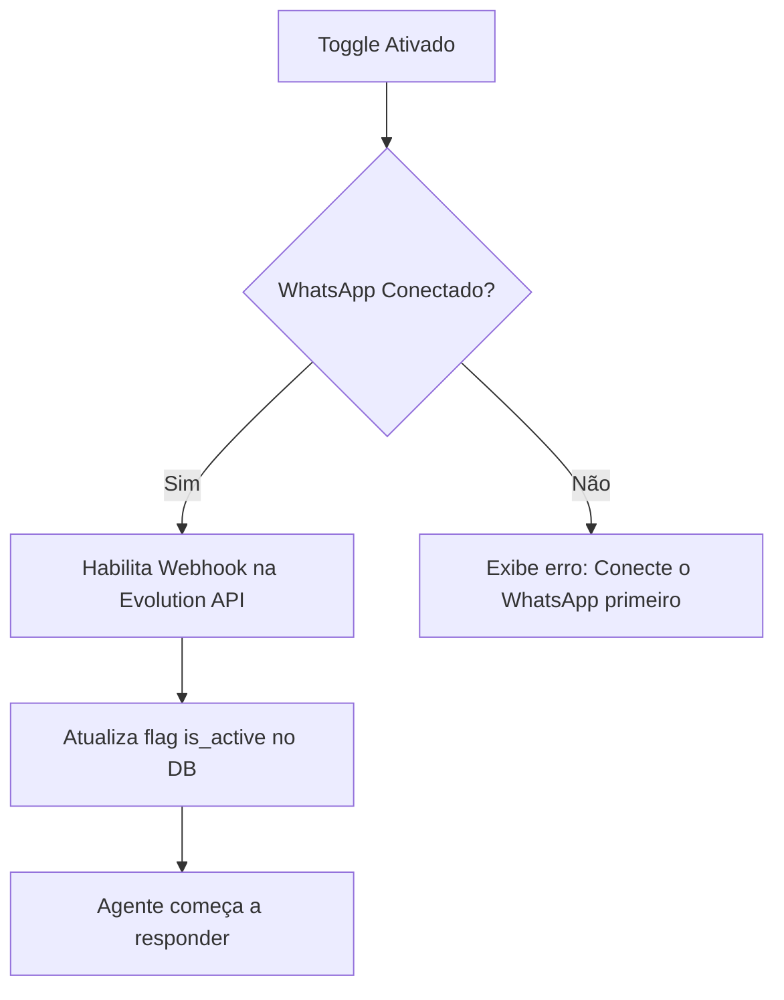
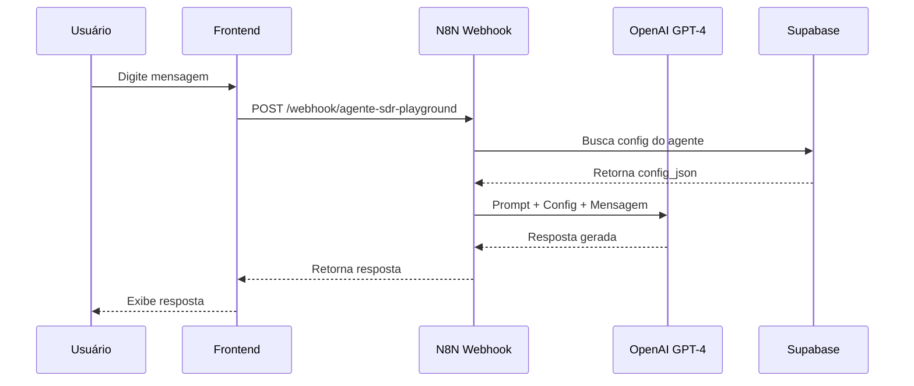
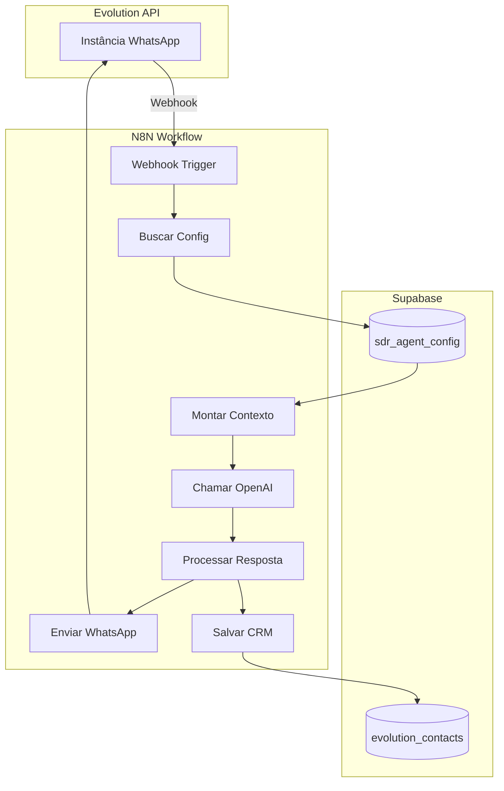

# 🤖 Guia Completo do Agente SDR

> **Última Atualização:** 15 de Dezembro de 2025  
> **Versão do App:** 2.0.0  
> **Autor:** Equipe Meu Agente

---

## 📋 Índice

1. [Visão Geral](#visão-geral)
2. [Requisitos e Pré-requisitos](#requisitos-e-pré-requisitos)
3. [Passo a Passo Completo](#passo-a-passo-completo)
4. [Configurações Detalhadas](#configurações-detalhadas)
5. [Integração com N8N](#integração-com-n8n)
6. [Gerenciamento de Múltiplas Instâncias](#gerenciamento-de-múltiplas-instâncias)
7. [Exemplos Práticos](#exemplos-práticos)
8. [Troubleshooting](#troubleshooting)
9. [FAQ](#faq)

---

## 🎯 Visão Geral

O **Agente SDR** (Sales Development Representative) é um sistema inteligente de automação de vendas via WhatsApp que combina:

- **Evolution API** para comunicação WhatsApp
- **N8N** para orquestração de workflows
- **OpenAI GPT-4** para respostas inteligentes
- **Supabase** para persistência de dados

### Capacidades Principais

✅ Responder mensagens automaticamente 24/7  
✅ Qualificar leads através de conversas naturais  
✅ Coletar informações estruturadas  
✅ Agendar reuniões e compromissos  
✅ Gerenciar múltiplas conexões WhatsApp simultaneamente  
✅ Personalização completa de tom e comportamento  

### Arquitetura do Sistema



---

## 🔐 Requisitos e Pré-requisitos

### Planos com Acesso

| Plano | Acesso SDR | Limite de Instâncias |
|-------|------------|---------------------|
| Free | ❌ Não | 0 |
| Basic | ❌ Não | 0 |
| **Business** | ✅ Sim | **2 instâncias** |
| **Premium** | ✅ Sim | **5 instâncias** |

### Requisitos Técnicos

- ✅ Plano Business ou Premium ativo
- ✅ Número de telefone válido (não pode ser o mesmo da conta)
- ✅ WhatsApp instalado em smartphone
- ✅ Internet estável durante o pareamento
- ✅ Webhook N8N configurado (automático)

### Limitações Conhecidas

⚠️ **Não é possível usar o mesmo número da conta principal**  
⚠️ **WhatsApp Business API requer aprovação do Meta para números oficiais**  
⚠️ **Evolution API usa protocolo não oficial (pode sofrer bloqueios)**  
⚠️ **Limite de 1000 contatos por sincronização**  

---

## 🚀 Passo a Passo Completo

### FASE 1: Criar Nova Conexão WhatsApp

#### 1.1. Acessar o Agente SDR

1. Navegue até **Menu Lateral > Agente SDR**
2. Se não tiver acesso, aparecerá card de upgrade
3. Click em "Ver Planos Disponíveis" para fazer upgrade

#### 1.2. Criar Instância

1. Clique em **"+ Nova Conexão"** no canto superior direito
2. Sistema verifica se você tem slots disponíveis:
   - **Business:** 2 instâncias máximo
   - **Premium:** 5 instâncias máximo
3. Digite um **nome personalizado** (ex: "WhatsApp Vendas")
4. Clique em **"Criar Conexão"**

**O que acontece nos bastidores:**



#### 1.3. Parear WhatsApp

**Opção A: QR Code (Mais Rápida)**

1. Abra WhatsApp no seu celular
2. Toque em **⋮ (3 pontos) > Dispositivos conectados**
3. Toque em **"Conectar um dispositivo"**
4. Escaneie o QR Code exibido na tela

**Opção B: Pairing Code (Alternativa)**

1. Abra WhatsApp no seu celular
2. Toque em **⋮ (3 pontos) > Dispositivos conectados**
3. Toque em **"Conectar um dispositivo"**
4. Toque em **"Conectar com número de telefone"**
5. Digite o código de 8 dígitos exibido (ex: `WZYEH1YY`)

**Tempo de expiração:**
- QR Code: 60 segundos
- Pairing Code: 5 minutos

**Estados de Conexão:**

| Status | Badge | Significado |
|--------|-------|-------------|
| `disconnected` | 🔴 Offline | Não conectado |
| `connecting` | 🟡 Conectando | Aguardando pareamento |
| `connected` | 🟢 Online | Funcionando normalmente |
| `error` | ⚠️ Erro | Problema na conexão |

### FASE 2: Configurar o Agente

Após a conexão, configure o comportamento do agente em **6 tabs**:

#### 2.1. Tab "Identidade"

Define quem é o agente e qual sua missão.

**Campos:**

| Campo | Descrição | Exemplo |
|-------|-----------|---------|
| **Nome do Agente** | Como o agente se apresenta | "Maria", "João", "Assistente Virtual" |
| **Nome da Empresa** | Sua empresa | "Filmadora Pro", "Consultoria XYZ" |
| **Descrição da Empresa** | O que a empresa faz | "Produção de vídeos profissionais para eventos" |
| **Missão do Agente** | Objetivo principal | "Agendar reuniões", "Coletar orçamentos" |

**Exemplo de configuração:**

```json
{
  "identidade": {
    "nome_agente": "Maria",
    "nome_empresa": "Filmadora Pro",
    "descricao_empresa": "Produção de vídeos profissionais para casamentos, eventos corporativos e formaturas",
    "missao": "Agendar reuniões de briefing e coletar informações sobre o evento"
  }
}
```

#### 2.2. Tab "Mensagens - Apresentação"

Defina como o agente se apresenta ao primeiro contato.

**Recursos:**

- ✅ Múltiplos modelos de mensagem (rotação automática)
- ✅ Drag & drop para reordenar
- ✅ Toggle ativo/inativo por modelo
- ✅ Variáveis dinâmicas: `{nome_agente}`, `{nome_empresa}`

**Estrutura:**

```typescript
{
  apresentacao: {
    modelos: [
      {
        id: "1",
        texto: "Oi! 👋 Sou a {nome_agente} da {nome_empresa}. Como posso ajudar?",
        ativo: true
      },
      {
        id: "2",
        texto: "Olá! Me chamo {nome_agente}, sou assistente virtual da {nome_empresa}.",
        ativo: true
      }
    ]
  }
}
```

**Dicas:**

💡 Use emojis para tornar mensagens mais amigáveis  
💡 Rotação de modelos evita spam filters  
💡 Mantenha mensagens curtas (máximo 2 linhas)  

#### 2.3. Tab "Qualificação de Leads"

Configure perguntas que o agente deve fazer para qualificar leads.

**Recursos:**

- ✅ Lista de requisitos arrastavél
- ✅ Adicionar/remover perguntas
- ✅ Ordem define prioridade

**Exemplo de requisitos:**

```json
{
  qualificacao: {
    requisitos: [
      "Tipo de evento (casamento, formatura, corporativo)",
      "Data e horário do evento",
      "Local (endereço completo)",
      "Quantidade estimada de convidados",
      "Serviços desejados (foto, vídeo, drone, livestream)",
      "Orçamento estimado",
      "Referências visuais (links ou descrição do estilo)"
    ]
  }
}
```

**Como funciona:**

1. Agente faz perguntas **uma por vez**
2. IA interpreta a resposta e marca como coletada
3. Passa para próximo requisito
4. Ao completar, notifica usuário

#### 2.4. Tab "Configurações de IA"

⚠️ **IMPORTANTE:** O campo `model` é forçado para `null` pois o modelo GPT é controlado pelo N8N.

**Sliders disponíveis:**

| Parâmetro | Range | Padrão | Descrição |
|-----------|-------|--------|-----------|
| **Temperature** | 0-2 | 0.7 | Criatividade (0=robótico, 2=criativo) |
| **Top P** | 0-1 | 0.9 | Diversidade de palavras |
| **Frequency Penalty** | -2 a 2 | 0 | Penaliza repetição de tokens |
| **Presence Penalty** | -2 a 2 | 0 | Incentiva novos tópicos |
| **Max Tokens** | 50-4000 | 500 | Tamanho máximo da resposta |

**Recomendações:**

| Caso de Uso | Temperature | Top P | Max Tokens |
|-------------|-------------|-------|------------|
| Atendimento formal | 0.5 | 0.8 | 300 |
| Conversação natural | 0.7 | 0.9 | 500 |
| Criativo/Marketing | 1.0 | 0.95 | 800 |

#### 2.5. Tab "Objeções"

Configure técnicas para contornar objeções comuns.

**Estrutura:**

```json
{
  objecoes: {
    tecnicas: [
      {
        id: "1",
        nome: "Preço alto",
        exemplo: "Entendo sua preocupação com investimento. Posso mostrar diferentes pacotes que cabem no seu orçamento?"
      },
      {
        id: "2",
        nome: "Preciso pensar",
        exemplo: "Sem problemas! Que tal agendarmos uma conversa rápida de 15min para tirar suas dúvidas?"
      }
    ]
  }
}
```

#### 2.6. Tab "Limitações"

Defina o que o agente **NÃO deve fazer**.

**Exemplos:**

```json
{
  limitacoes: [
    "Não responder perguntas fora do escopo de filmagem",
    "Não fazer promessas de preço sem consultar a equipe",
    "Nunca compartilhar dados de outros clientes",
    "Não recomendar concorrentes",
    "Não processar pagamentos ou cobranças"
  ]
}
```

### FASE 3: Ativar o Agente

#### 3.1. Toggle Ativo/Pausado

No **header da página**, você verá um switch:

- **🟢 Ativo (Play):** Agente responde automaticamente
- **🟡 Pausado (Pause):** Agente não responde

**Requisitos para ativar:**
- ✅ WhatsApp deve estar conectado
- ✅ Configuração deve estar salva

**O que muda ao ativar:**



### FASE 4: Testar no Playground

#### 4.1. Acessar Playground

1. No header, clique em **"Playground"**
2. Interface de chat será exibida

#### 4.2. Enviar Mensagens de Teste

1. Digite uma mensagem (ex: "Oi, quero fazer um orçamento")
2. Clique em **"Enviar"** ou pressione Enter
3. Aguarde resposta da IA (2-5 segundos)

**Fluxo do Playground:**



**Diferenças do modo produção:**

| Aspecto | Playground | Produção |
|---------|-----------|----------|
| Webhook | `/playground` | `/agente-sdr` |
| Envio WhatsApp | ❌ Não envia | ✅ Envia |
| Persistência | ❌ Não salva | ✅ Salva no CRM |
| Notificações | ❌ Não notifica | ✅ Notifica equipe |

---

## ⚙️ Configurações Detalhadas

### Configurações Avançadas da Instância

Cada instância WhatsApp possui configurações próprias:

#### Acessar Configurações

1. No card da instância, clique em **⋮ (3 pontos)**
2. Selecione **"Configurações Avançadas"**

#### Opções Disponíveis

| Configuração | Descrição | Padrão | Recomendação |
|--------------|-----------|--------|--------------|
| **Rejeitar Chamadas** | Rejeita automaticamente chamadas de voz/vídeo | ❌ Desligado | ✅ Ligar (evita spam) |
| **Mensagem de Chamada** | Texto enviado ao rejeitar | Vazio | "Desculpe, atendo apenas por mensagens" |
| **Ignorar Grupos** | Não responde em grupos WhatsApp | ❌ Desligado | ✅ Ligar (evita confusão) |
| **Sempre Online** | Mantém status online 24/7 | ✅ Ligado | ✅ Manter ligado |
| **Ler Mensagens** | Marca mensagens como lidas automaticamente | ❌ Desligado | ⚠️ A critério |
| **Ler Status** | Marca status (stories) como vistos | ❌ Desligado | ❌ Manter desligado |

### Estrutura de Dados Completa

#### Tabela: `evolution_instances`

```sql
CREATE TABLE evolution_instances (
  -- Identificação
  id UUID PRIMARY KEY DEFAULT gen_random_uuid(),
  phone TEXT NOT NULL,
  instance_name TEXT NOT NULL UNIQUE, -- Ex: sdr_5511999999999_1702912345
  instance_token TEXT, -- Token gerado pela Evolution API
  
  -- Conexão
  connection_status TEXT DEFAULT 'disconnected',
  whatsapp_number TEXT, -- Número conectado
  qr_code TEXT, -- Base64 do QR Code
  pairing_code TEXT, -- Código de pareamento (8 dígitos)
  last_qr_update TIMESTAMPTZ,
  connected_at TIMESTAMPTZ,
  
  -- Personalização
  display_name TEXT, -- Nome personalizado pelo usuário
  
  -- Auditoria
  created_at TIMESTAMPTZ DEFAULT NOW(),
  updated_at TIMESTAMPTZ DEFAULT NOW(),
  
  -- Foreign Key
  CONSTRAINT fk_evolution_instances_phone 
    FOREIGN KEY (phone) REFERENCES clientes(phone) ON DELETE CASCADE
);

-- Índices
CREATE INDEX idx_evolution_instances_phone ON evolution_instances(phone);
CREATE INDEX idx_evolution_instances_status ON evolution_instances(connection_status);
```

#### Tabela: `sdr_agent_config`

```sql
CREATE TABLE sdr_agent_config (
  -- Identificação
  id UUID PRIMARY KEY DEFAULT gen_random_uuid(),
  phone TEXT NOT NULL,
  instance_id UUID REFERENCES evolution_instances(id) ON DELETE CASCADE,
  
  -- Configuração (JSON completo)
  config_json JSONB NOT NULL,
  
  -- Estado
  is_active BOOLEAN DEFAULT true,
  
  -- Auditoria
  created_at TIMESTAMPTZ DEFAULT NOW(),
  updated_at TIMESTAMPTZ DEFAULT NOW(),
  
  -- Foreign Key
  CONSTRAINT fk_sdr_agent_config_phone 
    FOREIGN KEY (phone) REFERENCES clientes(phone) ON DELETE CASCADE
);

-- Índices
CREATE INDEX idx_sdr_agent_config_phone ON sdr_agent_config(phone);
CREATE INDEX idx_sdr_agent_config_instance ON sdr_agent_config(instance_id);
CREATE INDEX idx_sdr_agent_config_active ON sdr_agent_config(is_active);
```

---

## 🔗 Integração com N8N

### Arquitetura de Webhook



### Configuração do Webhook

#### URL Principal

```
https://webhook.meuagente.api.br/webhook/agente-sdr
```

#### Eventos Registrados

| Evento | Descrição | Ação N8N |
|--------|-----------|----------|
| `MESSAGES_UPSERT` | Nova mensagem recebida | Processar e responder |
| `CONNECTION_UPDATE` | Status de conexão mudou | Atualizar DB |
| `QRCODE_UPDATED` | QR Code foi regenerado | Atualizar frontend |

#### Payload Enviado pela Evolution

**Exemplo: Nova Mensagem**

```json
{
  "event": "messages.upsert",
  "instance": "sdr_5511999999999_1702912345",
  "data": {
    "key": {
      "remoteJid": "5511988887777@s.whatsapp.net",
      "fromMe": false,
      "id": "3EB0ABC123DEF456"
    },
    "message": {
      "conversation": "Olá, quero fazer um orçamento para filmagem"
    },
    "messageTimestamp": 1702912345,
    "pushName": "João Silva"
  }
}
```

### Fluxo N8N Detalhado

#### 1. Receber Webhook

```javascript
// Webhook Trigger Node
const payload = $input.all();
const event = payload[0].json.event;
const instance = payload[0].json.instance;
const data = payload[0].json.data;
```

#### 2. Buscar Configuração

```javascript
// Supabase Query Node
SELECT 
  config_json,
  is_active
FROM sdr_agent_config sac
JOIN evolution_instances ei ON ei.id = sac.instance_id
WHERE 
  ei.instance_name = '{{ $json.instance }}'
  AND sac.is_active = true
LIMIT 1;
```

#### 3. Montar Contexto para OpenAI

```javascript
// Function Node
const config = $json.config_json;
const message = $('Webhook').item.json.data.message.conversation;
const sender = $('Webhook').item.json.data.pushName;

const systemPrompt = `
Você é ${config.identidade.nome_agente}, assistente virtual da ${config.identidade.nome_empresa}.

Descrição da empresa: ${config.identidade.descricao_empresa}

Sua missão: ${config.identidade.missao}

Informações para coletar:
${config.qualificacao.requisitos.map((r, i) => `${i+1}. ${r}`).join('\n')}

Limitações:
${config.limitacoes.map(l => `- ${l}`).join('\n')}

Seja sempre educado, profissional e objetivo.
`;

return {
  systemPrompt,
  userMessage: message,
  sender,
  temperature: config.ia_config.temperature,
  max_tokens: config.ia_config.max_tokens
};
```

#### 4. Chamar OpenAI

```javascript
// OpenAI Node
{
  model: "gpt-4-turbo-preview",
  messages: [
    {
      role: "system",
      content: "{{ $json.systemPrompt }}"
    },
    {
      role: "user",
      content: "{{ $json.userMessage }}"
    }
  ],
  temperature: "{{ $json.temperature }}",
  max_tokens: "{{ $json.max_tokens }}"
}
```

#### 5. Enviar Resposta via Evolution

```javascript
// HTTP Request Node
POST https://evolution.meuagente.api.br/message/sendText/{{ $('Webhook').item.json.instance }}

Headers:
- apikey: $EVOLUTION_API_KEY

Body:
{
  "number": "{{ $('Webhook').item.json.data.key.remoteJid }}",
  "text": "{{ $('OpenAI').item.json.choices[0].message.content }}"
}
```

#### 6. Salvar no CRM

```javascript
// Supabase Insert/Update Node
INSERT INTO evolution_contacts (
  instance_id,
  phone,
  remote_jid,
  push_name,
  crm_last_interaction_at,
  crm_lead_status
) VALUES (
  '{{ $json.instance_id }}',
  '{{ $json.phone }}',
  '{{ $json.remote_jid }}',
  '{{ $json.push_name }}',
  NOW(),
  'contatado'
)
ON CONFLICT (instance_id, remote_jid) 
DO UPDATE SET
  crm_last_interaction_at = NOW(),
  crm_lead_status = COALESCE(evolution_contacts.crm_lead_status, 'contatado');
```

---

## 🔄 Gerenciamento de Múltiplas Instâncias

### Seletor de Instâncias

Quando você tem mais de 1 instância ativa:

#### Interface

```
┌────────────────────────────────────┐
│ Agente SDR                         │
│                                    │
│ ┌──────────────────────────────┐  │
│ │ 📱 WhatsApp Vendas      ⋁   │  │ <- Dropdown Selector
│ └──────────────────────────────┘  │
│                                    │
│ [🟢 Ativo] [Playground] [+ Nova]  │
└────────────────────────────────────┘
```

#### Lista de Instâncias

Ao clicar no dropdown:

```
┌──────────────────────────────────┐
│ 🟢 WhatsApp Vendas               │ <- Selecionada
│    5511999999999                 │
├──────────────────────────────────┤
│ 🟢 WhatsApp Suporte              │
│    5511888888888                 │
├──────────────────────────────────┤
│ 🔴 WhatsApp Marketing            │
│    Offline                       │
└──────────────────────────────────┘
```

### Cards Individuais

Cada instância possui seu próprio card:

```
┌─────────────────────────────────────────┐
│ 📱 WhatsApp Vendas          ✏️  🟢 Online│
│                                         │
│ ┌─────────────────────────────────────┐ │
│ │ [QR Code Image]                     │ │
│ │                                     │ │
│ │ Ou use o código: WZYEH1YY          │ │
│ └─────────────────────────────────────┘ │
│                                         │
│ 5511999999999@c.us                     │
│ Conectado há 2 horas                   │
│                                         │
│ [🔄 Atualizar] [🔌 Desconectar] [🗑️]   │
│                                         │
│ ⋮ Configurações Avançadas              │
└─────────────────────────────────────────┘
```

### Ações Disponíveis

#### Renomear Instância

1. Clique no ícone ✏️ ao lado do nome
2. Digite novo nome
3. Pressione Enter ou clique fora

**Código:**

```typescript
const handleRename = async (instanceId: string, newName: string) => {
  await supabase
    .from('evolution_instances')
    .update({ display_name: newName })
    .eq('id', instanceId);
};
```

#### Atualizar QR Code

1. Clique em **"🔄 Atualizar"**
2. Novo QR Code é gerado (expira em 60s)
3. Escaneie novamente

**Quando usar:**
- QR Code expirou
- Erro no pareamento
- Mudou de celular

#### Desconectar WhatsApp

1. Clique em **"🔌 Desconectar"**
2. Confirme a ação
3. WhatsApp faz logout
4. Configurações são mantidas

**Resultado:**
- Status: `disconnected`
- QR Code: Regenerado
- Config: Mantida

#### Deletar Instância

1. Clique em **"🗑️"**
2. Confirme permanentemente
3. Instância é removida

**⚠️ ATENÇÃO: Esta ação é IRREVERSÍVEL**

**O que é deletado:**
- Registro em `evolution_instances`
- Configuração em `sdr_agent_config`
- Contatos vinculados em `evolution_contacts` (opcional, dependendo de cascade)

---

## 💡 Exemplos Práticos

### Exemplo 1: Agente para Produtora de Vídeo

#### Configuração

```json
{
  "identidade": {
    "nome_agente": "Maria",
    "nome_empresa": "Filmadora Pro",
    "descricao_empresa": "Produção de vídeos profissionais para casamentos, formaturas e eventos corporativos",
    "missao": "Agendar reuniões de briefing e coletar informações sobre o evento"
  },
  "apresentacao": {
    "modelos": [
      {
        "id": "1",
        "texto": "Oi! 👋 Sou a Maria da Filmadora Pro. Vi que você tem interesse em nossos serviços de filmagem. Como posso ajudar?",
        "ativo": true
      }
    ]
  },
  "qualificacao": {
    "requisitos": [
      "Tipo de evento (casamento, formatura, corporativo)",
      "Data do evento",
      "Local (cidade e espaço)",
      "Horário de início e término",
      "Quantidade de convidados",
      "Serviços desejados (foto, vídeo, drone, livestream)",
      "Referências visuais ou estilo desejado",
      "Orçamento estimado"
    ]
  },
  "ia_config": {
    "model": null,
    "temperature": 0.7,
    "top_p": 0.9,
    "frequency_penalty": 0,
    "presence_penalty": 0,
    "max_tokens": 500
  },
  "objecoes": {
    "tecnicas": [
      {
        "id": "1",
        "nome": "Preço alto",
        "exemplo": "Entendo sua preocupação com investimento. Trabalhamos com diferentes pacotes. Que tal conversarmos para encontrar algo que caiba no seu orçamento?"
      },
      {
        "id": "2",
        "nome": "Preciso consultar",
        "exemplo": "Sem problemas! Quando você acha que terá uma resposta? Posso te enviar nosso portfólio enquanto isso."
      }
    ]
  },
  "limitacoes": [
    "Não fazer promessas de preço sem aprovação da equipe",
    "Não compartilhar detalhes de outros clientes",
    "Não recomendar outras produtoras",
    "Sempre direcionar questões técnicas complexas para a equipe"
  ]
}
```

#### Conversação Exemplo

```
Cliente: Oi, quanto custa para filmar um casamento?

Agente: Oi! 👋 Sou a Maria da Filmadora Pro. Que legal que você está interessado em nossos serviços! 

Para te passar um orçamento adequado, preciso de algumas informações:

1️⃣ Qual a data do casamento?

---

Cliente: 20 de junho de 2026

Agente: Perfeito! E em qual cidade e local será o casamento?

---

Cliente: Em São Paulo, no Espaço Gardens

Agente: Ótimo! Quantos convidados vocês esperam?

---

Cliente: Uns 150 convidados

Agente: Entendi! Vocês preferem apenas vídeo, ou querem também foto, drone ou livestream?

---

Cliente: Queremos vídeo + foto + drone

Agente: Excelente escolha! 🎥📸🚁

Com essas informações, vou preparar um orçamento personalizado para vocês.

Você tem alguma referência visual ou estilo que gostaria? Por exemplo: vídeo mais romântico, cinematográfico, documental?

---

Cliente: Queremos algo bem cinematográfico, tipo filme mesmo

Agente: Amei! Nosso estilo cinematográfico é o queridinho dos casais 🎬

Última pergunta: qual o orçamento que vocês têm em mente?

---

Cliente: Entre 8 e 10 mil

Agente: Perfeito! Temos opções que se encaixam no seu orçamento.

Vou agendar uma reunião com nossa equipe para mostrar nosso portfólio e fechar os detalhes. Qual melhor dia e horário para você?
```

### Exemplo 2: Agente para Consultoria B2B

#### Configuração

```json
{
  "identidade": {
    "nome_agente": "Roberto",
    "nome_empresa": "Consultoria Estratégica XYZ",
    "descricao_empresa": "Consultoria em transformação digital e gestão empresarial para PMEs",
    "missao": "Qualificar leads e agendar diagnóstico gratuito"
  },
  "apresentacao": {
    "modelos": [
      {
        "id": "1",
        "texto": "Olá! Sou Roberto, assistente virtual da Consultoria XYZ. Ajudo empresas a crescerem através de tecnologia. Como posso ajudar sua empresa?",
        "ativo": true
      }
    ]
  },
  "qualificacao": {
    "requisitos": [
      "Nome da empresa",
      "Segmento de atuação",
      "Faturamento anual aproximado",
      "Quantidade de funcionários",
      "Principais desafios atuais",
      "Já usa algum ERP ou sistema de gestão?",
      "Orçamento disponível para consultoria"
    ]
  },
  "ia_config": {
    "model": null,
    "temperature": 0.6,
    "top_p": 0.85,
    "frequency_penalty": 0.2,
    "presence_penalty": 0.1,
    "max_tokens": 400
  },
  "objecoes": {
    "tecnicas": [
      {
        "id": "1",
        "nome": "Não tenho tempo",
        "exemplo": "Entendo perfeitamente. Justamente por isso criamos um diagnóstico rápido de 30 minutos que já traz insights valiosos. Quando seria melhor?"
      }
    ]
  },
  "limitacoes": [
    "Não prometer resultados específicos sem análise",
    "Não criticar ferramentas que o cliente já usa",
    "Não fazer propostas comerciais sem aprovação",
    "Focar apenas em PMEs (faturamento até R$ 20mi/ano)"
  ]
}
```

### Exemplo 3: Agente para E-commerce

#### Configuração

```json
{
  "identidade": {
    "nome_agente": "Luna",
    "nome_empresa": "Loja Natureza Viva",
    "descricao_empresa": "E-commerce de produtos naturais, orgânicos e sustentáveis",
    "missao": "Responder dúvidas sobre produtos, coletar feedback e finalizar vendas"
  },
  "apresentacao": {
    "modelos": [
      {
        "id": "1",
        "texto": "Oi! 🌿 Sou a Luna da Natureza Viva. Como posso te ajudar hoje?",
        "ativo": true
      }
    ]
  },
  "qualificacao": {
    "requisitos": [
      "Qual tipo de produto procura? (skincare, suplementos, alimentos)",
      "Tem alguma restrição ou alergia?",
      "Já conhece nossa marca?",
      "Prefere receber por qual modalidade de entrega?"
    ]
  },
  "ia_config": {
    "model": null,
    "temperature": 0.8,
    "top_p": 0.92,
    "frequency_penalty": 0,
    "presence_penalty": 0.3,
    "max_tokens": 350
  },
  "objecoes": {
    "tecnicas": [
      {
        "id": "1",
        "nome": "Frete caro",
        "exemplo": "Entendo! Temos frete grátis para compras acima de R$ 149. Quer que eu monte um combo que atinja esse valor?"
      }
    ]
  },
  "limitacoes": [
    "Não fazer diagnósticos médicos",
    "Não substituir orientação de nutricionista",
    "Sempre indicar consultar profissional de saúde em casos de dúvidas sérias",
    "Não processar pagamentos diretamente (direcionar para site)"
  ]
}
```

---

## 🔧 Troubleshooting

### Problemas Comuns e Soluções

#### ❌ QR Code não aparece

**Sintomas:**
- Tela branca no card
- Loading infinito
- Erro "Failed to fetch"

**Causas possíveis:**
1. Evolution API offline
2. Instância não foi criada corretamente
3. Limite de instâncias atingido

**Soluções:**
1. Verifique se Evolution API está rodando
2. Delete a instância e crie novamente
3. Verifique seu plano (Business=2, Premium=5)
4. Limpe cache do navegador

**Código para debug:**

```typescript
// Ver logs no console
console.log('Instance ID:', instanceId);
console.log('QR Code:', qrCode);

// Testar Evolution API manualmente
curl -X POST https://evolution.meuagente.api.br/instance/connect/INSTANCE_NAME \
  -H "apikey: YOUR_KEY"
```

#### ❌ WhatsApp não conecta após escanear QR Code

**Sintomas:**
- QR escaneado mas status continua "connecting"
- Após 30s volta para "disconnected"

**Causas possíveis:**
1. WhatsApp já conectado em outro dispositivo (limite: 4 dispositivos)
2. QR Code expirado
3. Bloqueio do WhatsApp por uso de API não oficial

**Soluções:**
1. Desconecte outros dispositivos: WhatsApp > Dispositivos Conectados > Remova dispositivos antigos
2. Gere novo QR Code (clique em "Atualizar")
3. Se bloqueado, aguarde 24h antes de tentar novamente
4. Use número diferente (considere WhatsApp Business)

#### ❌ Agente não responde mensagens

**Sintomas:**
- Toggle está ativo
- WhatsApp está conectado
- Mas mensagens não são respondidas

**Causas possíveis:**
1. Webhook não configurado
2. N8N workflow pausado ou com erro
3. Configuração do agente não foi salva

**Soluções:**

**1. Verificar webhook:**

```bash
# Via Edge Function
curl -X POST https://SUPABASE_URL/functions/v1/configure-evolution-webhook \
  -H "apikey: YOUR_KEY" \
  -H "Authorization: Bearer YOUR_JWT" \
  -d '{"instance_id": "UUID", "enabled": true}'
```

**2. Testar N8N manualmente:**

```bash
curl -X POST https://webhook.meuagente.api.br/webhook/agente-sdr \
  -H "Content-Type: application/json" \
  -d '{
    "event": "messages.upsert",
    "instance": "sdr_5511999999999_1234567890",
    "data": {
      "key": {
        "remoteJid": "5511999999999@s.whatsapp.net",
        "fromMe": false
      },
      "message": {
        "conversation": "teste"
      }
    }
  }'
```

**3. Verificar configuração salva:**

```sql
SELECT 
  is_active,
  config_json->>'identidade' as identidade
FROM sdr_agent_config
WHERE instance_id = 'UUID';
```

#### ❌ Resposta da IA está genérica demais

**Sintomas:**
- Agente responde mas não usa contexto da empresa
- Respostas são muito curtas ou vagas
- Não faz perguntas de qualificação

**Causas possíveis:**
1. Configuração não chegou ao N8N
2. Temperature muito baixa
3. Max tokens insuficiente

**Soluções:**
1. Verifique se `config_json` está populado no banco
2. Aumente temperature para 0.7-0.9
3. Aumente max_tokens para 500-800
4. Adicione mais detalhes na "Descrição da Empresa"

#### ❌ Erro "Maximum instances reached"

**Sintomas:**
- Botão "+ Nova Conexão" desabilitado
- Mensagem: "Você atingiu o limite de instâncias"

**Causas:**
- Business: Já tem 2 instâncias ativas
- Premium: Já tem 5 instâncias ativas

**Soluções:**
1. Delete instâncias não usadas
2. Faça upgrade de plano (Business → Premium)
3. Entre em contato com suporte para limite personalizado

#### ❌ Webhook retorna erro 500

**Sintomas:**
- Logs do N8N mostram erro 500
- Evolution API envia mensagem mas N8N falha

**Causas possíveis:**
1. OpenAI API key expirada
2. Supabase fora do ar
3. Erro no código N8N

**Soluções:**

**1. Verificar OpenAI API:**

```bash
curl https://api.openai.com/v1/models \
  -H "Authorization: Bearer YOUR_OPENAI_KEY"
```

**2. Verificar Supabase:**

```bash
curl https://SUPABASE_URL/rest/v1/sdr_agent_config?select=* \
  -H "apikey: YOUR_KEY"
```

**3. Ver logs N8N:**
- Acesse dashboard N8N
- Vá em Executions
- Veja último erro

### Logs e Debugging

#### Frontend (Console do Navegador)

```typescript
// Habilitar logs detalhados
localStorage.setItem('debug', 'sdr:*');

// Logs aparecerão com:
// [SDR] Creating instance...
// [SDR] QR Code received
// [SDR] Connection status: connected
```

#### Backend (Edge Functions)

```typescript
// No código da Edge Function
console.log('Evolution API Response:', {
  status: response.status,
  data: await response.json()
});

// Ver logs
supabase functions logs create-evolution-instance --tail
```

#### N8N (Workflow Logs)

1. Acesse N8N: `https://n8n.meuagente.api.br`
2. Clique em **"Executions"** no menu lateral
3. Veja últimas execuções
4. Clique em execução com erro para ver detalhes

---

## ❓ FAQ (Perguntas Frequentes)

### Geral

**Q: Posso usar o mesmo número da minha conta principal?**  
R: ❌ Não. Você precisa de um número diferente para o Agente SDR. Use um segundo chip ou número de empresa.

**Q: Preciso pagar separadamente pela Evolution API?**  
R: ❌ Não. A Evolution API já está inclusa no plano Business e Premium.

**Q: Posso usar WhatsApp Business?**  
R: ✅ Sim! Funciona tanto com WhatsApp pessoal quanto Business.

**Q: Quantas mensagens posso enviar por dia?**  
R: 🔢 Não há limite técnico, mas WhatsApp pode bloquear por spam se enviar muitas mensagens em pouco tempo. Recomendamos máximo 500 mensagens/dia por instância.

### Planos e Limites

**Q: Posso testar o Agente SDR gratuitamente?**  
R: ⚠️ O plano Free não tem acesso ao SDR. Você pode fazer upgrade para Business (R$ 497/mês) com 7 dias de período de arrependimento (CDC).

**Q: Qual a diferença entre Business e Premium no SDR?**  
R: 
- **Business:** 2 instâncias WhatsApp
- **Premium:** 5 instâncias WhatsApp + recursos extras (Web Search, Data Scraping)

**Q: Posso adicionar mais instâncias além do limite?**  
R: 💬 Entre em contato com suporte. Podemos criar planos personalizados para necessidades específicas.

### Configuração

**Q: Posso ter configurações diferentes para cada instância?**  
R: ✅ Sim! Cada instância tem sua própria configuração em `sdr_agent_config`.

**Q: Como faço para o agente parar de responder temporariamente?**  
R: 🔀 Use o toggle "Ativo/Pausado" no header. Isso desabilita o webhook sem desconectar o WhatsApp.

**Q: Posso usar emojis nas mensagens?**  
R: ✅ Sim! Emojis deixam as mensagens mais amigáveis. Use à vontade.

**Q: Quantas perguntas de qualificação posso adicionar?**  
R: 🔢 Não há limite, mas recomendamos máximo 8 perguntas para não cansar o lead.

### Técnicas

**Q: O que acontece se o cliente enviar áudio em vez de texto?**  
R: 🎤 Atualmente, o agente responde pedindo para enviar mensagem de texto. Estamos trabalhando em transcrição de áudio (próxima versão).

**Q: O agente funciona em grupos do WhatsApp?**  
R: ⚠️ Tecnicamente sim, mas recomendamos DESLIGAR a opção "Ignorar Grupos" nas configurações avançadas, pois pode gerar confusão.

**Q: Posso integrar com meu CRM externo (HubSpot, RD Station)?**  
R: 🔜 Em breve! Por enquanto, os leads ficam salvos no CRM interno do Meu Agente.

**Q: Como faço backup das conversas?**  
R: 💾 As conversas ficam salvas no WhatsApp. Para backup estruturado, estamos desenvolvendo recurso de exportação.

### Segurança e Privacidade

**Q: O agente tem acesso às minhas conversas pessoais?**  
R: ❌ Não. O agente só processa mensagens enviadas para o número conectado naquela instância específica.

**Q: Os dados são compartilhados com terceiros?**  
R: 🔒 Não. Dados ficam no Supabase (servidor dedicado) e só são enviados para OpenAI para processamento de IA (com criptografia).

**Q: Posso deletar todos os dados de uma vez?**  
R: ✅ Sim. Ao deletar a instância, todos os dados relacionados são removidos (configuração + contatos).

### Billing e Custos

**Q: A OpenAI cobra separadamente?**  
R: ❌ Não. O custo de uso da OpenAI já está incluso no plano Business/Premium.

**Q: O que acontece se eu cancelar o plano?**  
R: 🔴 O Agente SDR para de funcionar imediatamente. Seus dados ficam salvos por 30 dias caso queira reativar.

**Q: Posso pagar apenas pelos meses que usar?**  
R: ⚠️ Os planos são mensais recorrentes. Você pode cancelar a qualquer momento (vale até o fim do ciclo).

### Suporte

**Q: Como entro em contato com suporte?**  
R: 💬 
- Planos Business/Premium: Suporte 24/7 via WhatsApp (botão no app)
- Chat ao vivo no app
- Email: suporte@meuagente.api.br

**Q: Vocês fazem configuração personalizada do agente?**  
R: ✅ Sim! Clientes Premium têm direito a 1 configuração gratuita por mês com nosso time de especialistas.

---

## 📚 Recursos Adicionais

### Documentação Relacionada

- [Guia Completo do CRM Pipeline](./GUIA_COMPLETO_CRM_PIPELINE.md)
- [Importação de Contatos WhatsApp](./IMPORTACAO_CONTATOS_WHATSAPP.md)
- [Limites e Recursos por Plano](./LIMITES_PLANOS_RECURSOS.md)
- [Documentação Técnica Completa](./DOCUMENTACAO_TECNICA_COMPLETA.md)

### Links Úteis

- **Evolution API Docs:** https://doc.evolution-api.com/
- **N8N Documentation:** https://docs.n8n.io/
- **OpenAI API Reference:** https://platform.openai.com/docs/api-reference
- **WhatsApp Business Guidelines:** https://www.whatsapp.com/legal/business-policy

### Vídeos Tutoriais

🎥 **Em breve:** Tutoriais em vídeo demonstrando:
- Configuração inicial do Agente SDR
- Criação de múltiplas instâncias
- Otimização de configurações de IA
- Análise de conversões no CRM

---

## 📞 Contato e Suporte

**Dúvidas ou problemas?**

📧 Email: suporte@meuagente.api.br  
💬 WhatsApp: (11) 99999-9999 (Apenas planos Business/Premium)  
🌐 Portal: https://meuagente.api.br/suporte  
📚 Base de Conhecimento: https://help.meuagente.api.br

**Horário de Atendimento:**
- Business/Premium: 24/7 (suporte prioritário)
- Basic: Segunda a Sexta, 9h às 18h

---

**Documento mantido por:** Equipe Meu Agente  
**Última revisão:** 15/12/2025  
**Próxima revisão prevista:** 15/01/2026
