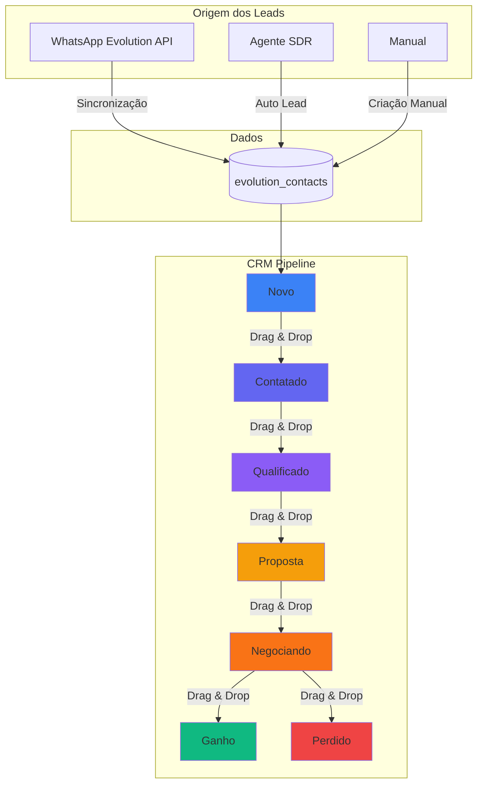
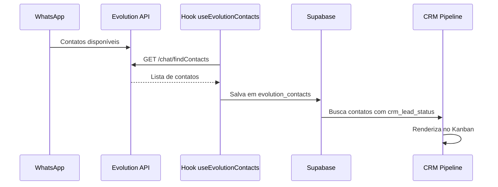
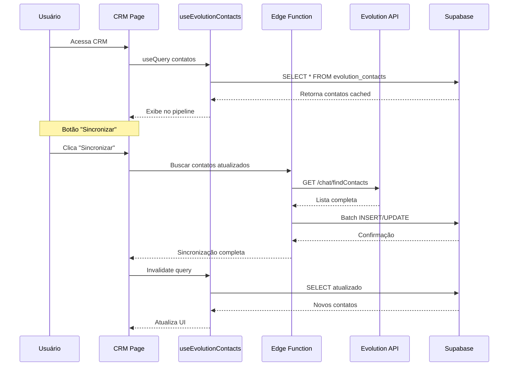

# 📊 Guia Completo do CRM Pipeline

> **Última Atualização:** 15 de Dezembro de 2025  
> **Versão do App:** 2.0.0  
> **Autor:** Equipe Meu Agente

---

## 📋 Índice

1. [Visão Geral](#visão-geral)
2. [Requisitos e Pré-requisitos](#requisitos-e-pré-requisitos)
3. [Passo a Passo Completo](#passo-a-passo-completo)
4. [Estágios do Pipeline](#estágios-do-pipeline)
5. [Integração com WhatsApp](#integração-com-whatsapp)
6. [Gestão de Leads](#gestão-de-leads)
7. [Métricas e Relatórios](#métricas-e-relatórios)
8. [Exemplos Práticos](#exemplos-práticos)
9. [Troubleshooting](#troubleshooting)
10. [FAQ](#faq)

---

## 🎯 Visão Geral

O **CRM Pipeline** é um sistema Kanban completo para gestão de leads e oportunidades de vendas, integrado nativamente com contatos do WhatsApp.

### Capacidades Principais

✅ Pipeline Kanban visual com 7 estágios  
✅ Drag & drop para mover leads entre estágios  
✅ Integração automática com contatos do WhatsApp  
✅ Detalhes completos de cada lead (notas, tarefas, eventos)  
✅ Métricas de conversão em tempo real  
✅ Filtros e busca avançada  
✅ Sincronização bidirecional com Agente SDR  

### Arquitetura do Sistema



---

## 🔐 Requisitos e Pré-requisitos

### Planos com Acesso

| Plano | Acesso CRM | Recursos |
|-------|------------|----------|
| Free | ❌ Não | - |
| Basic | ❌ Não | - |
| **Business** | ✅ Sim | CRM Completo + 2 WhatsApps |
| **Premium** | ✅ Sim | CRM Completo + 5 WhatsApps + Relatórios Avançados |

### Requisitos Técnicos

- ✅ Plano Business ou Premium ativo
- ✅ (Opcional) WhatsApp conectado via Agente SDR para sincronização automática
- ✅ Navegador moderno (Chrome, Firefox, Edge, Safari)

### Conceitos Importantes

**Lead:** Potencial cliente em qualquer estágio do pipeline  
**Pipeline:** Fluxo de vendas desde primeiro contato até fechamento  
**Conversão:** Taxa de leads que avançam de um estágio para outro  
**Score:** Pontuação de qualificação do lead (0-100)  

---

## 🚀 Passo a Passo Completo

### FASE 1: Acessar o CRM

#### 1.1. Navegação

1. Clique em **Menu Lateral > CRM**
2. Se não tiver acesso, aparecerá card de upgrade
3. Interface do Pipeline será carregada

#### 1.2. Interface Inicial

```
┌─────────────────────────────────────────────────────────────┐
│ CRM Pipeline                          [Busca...] [Filtros] │
│                                                             │
│ 📊 Métricas:  45 Leads | R$ 50k Pipeline | 15% Conversão  │
│                                                             │
│ ┌─────┐  ┌─────┐  ┌─────┐  ┌─────┐  ┌─────┐  ┌───┐ ┌───┐ │
│ │Novo │  │Cont.│  │Qual.│  │Prop.│  │Nego.│  │Gan│ │Per│ │
│ │ 15  │  │  12 │  │  8  │  │  5  │  │  3  │  │ 1 │ │ 1 │ │
│ └─────┘  └─────┘  └─────┘  └─────┘  └─────┘  └───┘ └───┘ │
│   │        │        │        │        │        │     │    │
│  [Card]  [Card]  [Card]  [Card]  [Card]  [Card] [Card]  │
│  [Card]  [Card]  [Card]  [Card]  [Card]                  │
│  [...]   [...]   [...]   [...]   [...]                   │
└─────────────────────────────────────────────────────────────┘
```

### FASE 2: Importar Contatos do WhatsApp

#### 2.1. Sincronização Automática

Se você tem o **Agente SDR** configurado:

1. Contatos do WhatsApp são sincronizados automaticamente
2. Aparecem na coluna **"Novo"** do pipeline
3. Metadados do WhatsApp são preservados (foto, nome, número)

**Fluxo de sincronização:**



#### 2.2. Criação Manual de Lead

Se não tiver WhatsApp conectado:

1. Clique em **"+ Novo Lead"** no canto superior direito
2. Preencha:
   - Nome completo
   - Telefone (com DDD)
   - Email (opcional)
   - Origem do lead (Google, Instagram, Indicação, etc)
3. Clique em **"Criar Lead"**

**Campos do formulário:**

```typescript
interface NewLeadForm {
  nome: string;              // Obrigatório
  telefone: string;          // Obrigatório (formato: 5511999999999)
  email?: string;            // Opcional
  origem: LeadSource;        // Enum: 'whatsapp' | 'google' | 'instagram' | 'indicacao' | 'outros'
  notas?: string;            // Opcional
  tags?: string[];           // Opcional
  score?: number;            // Opcional (0-100, padrão: 50)
}
```

### FASE 3: Gerenciar Leads no Pipeline

#### 3.1. Estrutura do Card de Lead

Cada lead é representado por um card com:

```
┌──────────────────────────────┐
│ 👤 João Silva          ⭐ 85 │ <- Nome + Score
│ 📱 (11) 99999-9999           │ <- Telefone
│                              │
│ 🏷️ urgente  qualificado       │ <- Tags
│                              │
│ 📝 2 notas  ✅ 1 tarefa      │ <- Resumo
│                              │
│ ⏰ Última interação: 2h      │ <- Timestamp
│                              │
│ [Ver Detalhes]        [⋮]   │ <- Ações
└──────────────────────────────┘
```

**Elementos do card:**

| Elemento | Descrição |
|----------|-----------|
| **Avatar** | Foto do WhatsApp ou iniciais |
| **Nome** | Nome completo do lead |
| **Score** | Pontuação de qualificação (0-100) |
| **Telefone** | Número com máscara |
| **Tags** | Etiquetas personalizadas |
| **Resumo** | Quantidade de notas, tarefas, eventos |
| **Última Interação** | Tempo desde último contato |
| **Botões** | Ver detalhes e menu de contexto |

#### 3.2. Mover Lead entre Estágios (Drag & Drop)

**Método 1: Arrastar e Soltar**

1. Clique e segure no card do lead
2. Arraste até a coluna desejada
3. Solte o mouse
4. Card será movido com animação suave

**Método 2: Menu de Contexto**

1. Clique no ícone **⋮** (3 pontos) no card
2. Selecione **"Mover para..."**
3. Escolha o estágio desejado
4. Lead será movido

**Validações:**

✅ Qualquer lead pode ser movido para qualquer estágio  
⚠️ Mover de "Novo" para "Ganho" diretamente é permitido mas não recomendado  
📊 Sistema registra todas as movimentações para relatórios  

**Código da movimentação:**

```typescript
const handleDragEnd = async (result: DropResult) => {
  const { source, destination, draggableId } = result;
  
  if (!destination) return;
  if (source.droppableId === destination.droppableId) return;
  
  // Atualização otimista (UI primeiro)
  updateLeadStatusLocally(draggableId, destination.droppableId);
  
  // Atualização no banco
  await supabase
    .from('evolution_contacts')
    .update({ 
      crm_lead_status: destination.droppableId,
      crm_last_interaction_at: new Date().toISOString()
    })
    .eq('id', draggableId);
  
  // Invalidar queries do React Query
  queryClient.invalidateQueries(['crm-pipeline']);
};
```

### FASE 4: Ver Detalhes do Lead

#### 4.1. Abrir Sheet de Detalhes

1. Clique em **"Ver Detalhes"** no card
2. Sheet lateral será aberto
3. Informações completas serão exibidas

#### 4.2. Estrutura do Sheet

```
┌────────────────────────────────────────┐
│  [X] Fechar                            │
│                                        │
│  👤 João Silva                    ⭐ 85│
│  📱 (11) 99999-9999                    │
│  📧 joao@email.com                     │
│                                        │
│  🔵 Qualificado                        │
│                                        │
│  [💬 WhatsApp] [📞 Ligar] [📧 Email] │
│                                        │
│  ┌───────────────────────────────────┐│
│  │ Tabs:                             ││
│  │ [Tarefas] [Agenda] [Notas]        ││
│  │                                   ││
│  │ (Conteúdo da tab selecionada)    ││
│  │                                   ││
│  └───────────────────────────────────┘│
│                                        │
│  [Salvar] [Deletar]                   │
└────────────────────────────────────────┘
```

#### 4.3. Tab "Tarefas"

**Funcionalidades:**

- ✅ Listar tarefas vinculadas ao lead
- ✅ Criar nova tarefa
- ✅ Marcar como concluída
- ✅ Editar tarefa existente
- ✅ Deletar tarefa

**Exemplo de tarefa:**

```typescript
{
  id: "uuid",
  titulo: "Enviar proposta comercial",
  descricao: "Proposta para filmagem de casamento - pacote completo",
  vencimento: "2025-12-20T10:00:00Z",
  prioridade: "alta",
  concluida: false,
  vinculo_lead: "5511999999999@s.whatsapp.net"
}
```

**Criação rápida:**

1. Clique em **"+ Nova Tarefa"**
2. Digite título (mínimo)
3. (Opcional) Preencha descrição, data, prioridade
4. Clique em **"Criar"**
5. Tarefa aparece na lista

#### 4.4. Tab "Agenda"

**Funcionalidades:**

- ✅ Visualizar eventos futuros com o lead
- ✅ Criar reunião/ligação
- ✅ Sincronizar com Google Calendar (futuro)

**Exemplo de evento:**

```typescript
{
  id: "uuid",
  titulo: "Reunião de Briefing - João Silva",
  data_inicio: "2025-12-18T14:00:00Z",
  data_fim: "2025-12-18T15:00:00Z",
  tipo: "reuniao",
  local: "Google Meet",
  participantes: ["joao@email.com"],
  vinculo_lead: "5511999999999@s.whatsapp.net"
}
```

#### 4.5. Tab "Notas"

**Funcionalidades:**

- ✅ Adicionar notas sobre o lead
- ✅ Histórico cronológico de interações
- ✅ Markdown suportado
- ✅ Busca em notas

**Exemplo de nota:**

```markdown
## Primeira Conversa - 15/12/2025

Cliente interessado em pacote de filmagem para casamento.

**Detalhes coletados:**
- Data: 20/06/2026
- Local: Espaço Gardens (SP)
- Convidados: ~150 pessoas
- Serviços: Vídeo + Foto + Drone
- Orçamento: R$ 8-10k

**Próximos passos:**
- [ ] Enviar portfólio
- [ ] Agendar reunião presencial
- [ ] Preparar proposta comercial
```

**Salvamento:**

- ⚡ Auto-save a cada 2 segundos (debounced)
- 💾 Salvar manual: Ctrl+S
- 📝 Histórico de versões (futuro)

---

## 📊 Estágios do Pipeline

### 7 Estágios Padrão

#### 1. 🔵 Novo (Novo Lead)

**Descrição:** Lead acabou de entrar no sistema

**Características:**
- Primeiro contato ainda não realizado
- Informações mínimas (nome + telefone)
- Origem identificada (WhatsApp, Instagram, etc)

**Ações recomendadas:**
- ✅ Fazer primeiro contato em até 5 minutos (regra de ouro)
- ✅ Qualificar interesse (quente, morno, frio)
- ✅ Coletar informações básicas

**Tempo médio:** 0-24 horas

---

#### 2. 🟣 Contatado (Primeiro Contato Feito)

**Descrição:** Já houve comunicação inicial com o lead

**Características:**
- Pelo menos 1 mensagem enviada/recebida
- Lead respondeu ou demonstrou interesse
- Informações básicas coletadas

**Ações recomendadas:**
- ✅ Qualificar necessidade
- ✅ Entender orçamento
- ✅ Identificar decisor
- ✅ Coletar requisitos

**Tempo médio:** 1-3 dias

---

#### 3. 🟪 Qualificado (Lead Qualificado)

**Descrição:** Lead tem potencial real de compra

**Características:**
- Budget identificado (tem orçamento)
- Authority confirmada (é o decisor ou tem acesso)
- Need validada (necessidade genuína)
- Timing adequado (vai decidir em breve)

**Critério BANT:**
- **B**udget: Tem orçamento?
- **A**uthority: É o decisor?
- **N**eed: Tem necessidade real?
- **T**iming: Quando vai decidir?

**Ações recomendadas:**
- ✅ Agendar demo/reunião
- ✅ Enviar case studies
- ✅ Preparar proposta customizada

**Tempo médio:** 3-7 dias

---

#### 4. 🟠 Proposta (Proposta Enviada)

**Descrição:** Proposta comercial foi enviada ao lead

**Características:**
- Proposta formal com preços
- Prazo de validade definido
- Follow-up agendado

**Ações recomendadas:**
- ✅ Confirmar recebimento da proposta
- ✅ Agendar call para tirar dúvidas
- ✅ Oferecer ajustes se necessário
- ✅ Enviar testimonials/cases

**Tempo médio:** 7-14 dias

---

#### 5. 🟡 Em Negociação (Negociando Contrato)

**Descrição:** Lead está negociando termos, preços ou condições

**Características:**
- Lead interessado mas com objeções
- Pode estar comparando com concorrentes
- Negociação de prazo, preço, escopo

**Objeções comuns:**
- "Preço está alto"
- "Preciso de mais prazo para decidir"
- "Estou analisando outras opções"
- "Precisa aprovar com sócio/CFO"

**Ações recomendadas:**
- ✅ Aplicar técnicas de contorno de objeções
- ✅ Oferecer pagamento facilitado
- ✅ Destacar diferenciais vs concorrentes
- ✅ Criar senso de urgência (desconto por tempo limitado)

**Tempo médio:** 14-30 dias

---

#### 6. 🟢 Ganho (Deal Fechado)

**Descrição:** Lead virou cliente! 🎉

**Características:**
- Contrato assinado ou pedido confirmado
- Pagamento realizado ou agendado
- Projeto/serviço iniciado

**Ações recomendadas:**
- ✅ Celebrar com o time! 🍾
- ✅ Fazer onboarding do cliente
- ✅ Pedir indicação (NPS)
- ✅ Mover para sistema de CS (Customer Success)

**Tempo médio de conversão:** 30-60 dias (do primeiro contato)

**Métricas importantes:**
- **Ticket médio:** Valor do contrato
- **Lifetime Value:** Valor total esperado do cliente
- **CAC:** Custo de Aquisição do Cliente

---

#### 7. 🔴 Perdido (Deal Perdido)

**Descrição:** Lead não avançou para fechamento

**Características:**
- Lead não respondeu por >30 dias
- Lead escolheu concorrente
- Lead não tem budget
- Lead decidiu não contratar

**Motivos comuns:**
- 💰 Preço muito alto
- ⏰ Timing inadequado (vai contratar só ano que vem)
- 🏆 Escolheu concorrente
- 📉 Perdeu interesse/necessidade
- 👻 Ghosting (parou de responder)

**Ações recomendadas:**
- ✅ Registrar motivo da perda
- ✅ Pedir feedback sincero
- ✅ Manter contato para futuras oportunidades (nurturing)
- ✅ Adicionar à campanha de reengajamento

**Re-engajamento:**
- Enviar conteúdo relevante mensalmente
- Checar novamente em 3-6 meses
- Oferecer promoção especial

---

## 🔗 Integração com WhatsApp

### Sincronização de Contatos

#### Como Funciona



#### Campos Sincronizados

```typescript
interface EvolutionContact {
  // Identificação
  id: string;
  instance_id: string;
  phone: string;
  
  // Dados do WhatsApp
  remote_jid: string;           // Ex: 5511999999999@s.whatsapp.net
  push_name: string | null;     // Nome do contato
  profile_pic_url: string | null; // URL da foto
  is_group: boolean;            // É grupo?
  is_saved: boolean;            // Está salvo nos contatos?
  
  // Sincronização
  synced_at: string;            // Timestamp da última sync
  sync_source: 'manual' | 'auto' | 'webhook';
  
  // CRM Fields (campos customizados)
  crm_notes: string | null;
  crm_tags: string[] | null;
  crm_favorite: boolean;
  crm_last_interaction_at: string | null;
  crm_lead_status: LeadStatus | null;  // Status no pipeline
  crm_lead_score: number;              // Score 0-100
  
  // Auditoria
  created_at: string;
  updated_at: string;
}
```

### Ações Disponíveis

#### 1. Enviar Mensagem WhatsApp

**Local:** Sheet de detalhes do lead

**Fluxo:**

1. Clique no botão **"💬 WhatsApp"**
2. Digite a mensagem
3. Clique em **"Enviar"**
4. Mensagem é enviada via Evolution API
5. Registro é salvo no histórico

**Código:**

```typescript
const sendWhatsAppMessage = async (leadId: string, message: string) => {
  // Buscar instância ativa
  const { data: instance } = await supabase
    .from('evolution_instances')
    .select('instance_name')
    .eq('connection_status', 'connected')
    .single();
  
  // Enviar via Edge Function
  const { data, error } = await supabase.functions.invoke('send-evolution-text', {
    body: {
      instance_id: instance.id,
      number: leadId, // remote_jid
      text: message
    }
  });
  
  if (!error) {
    // Atualizar última interação
    await supabase
      .from('evolution_contacts')
      .update({ crm_last_interaction_at: new Date().toISOString() })
      .eq('remote_jid', leadId);
  }
};
```

#### 2. Criar Lead Manualmente

**Uso:** Quando lead vem de outra fonte (Google, Instagram, etc)

**Fluxo:**

1. Clique em **"+ Novo Lead"**
2. Preencha formulário
3. Sistema cria registro em `evolution_contacts`
4. Lead aparece na coluna "Novo"

**Diferença de lead manual vs WhatsApp:**

| Campo | Lead WhatsApp | Lead Manual |
|-------|---------------|-------------|
| `remote_jid` | `5511999999999@s.whatsapp.net` | `manual_uuid@manual` |
| `profile_pic_url` | URL real | null |
| `is_saved` | Baseado no WhatsApp | false |
| `sync_source` | `auto` | `manual` |

---

## 📈 Métricas e Relatórios

### Métricas Principais

#### 1. Total de Leads

```typescript
const totalLeads = allLeads.length;
```

**Exibição:**
```
📊 45 Leads no pipeline
```

#### 2. Valor Total do Pipeline

```typescript
const valorPipeline = allLeads
  .filter(l => !['ganho', 'perdido'].includes(l.crm_lead_status))
  .reduce((sum, lead) => sum + (lead.valor_estimado || 0), 0);
```

**Exibição:**
```
💰 R$ 127.500,00 em negociação
```

⚠️ **Nota:** Campo `valor_estimado` ainda não implementado. Usar valor padrão por enquanto.

#### 3. Taxa de Conversão

```typescript
const leadsGanhos = allLeads.filter(l => l.crm_lead_status === 'ganho').length;
const taxaConversao = (leadsGanhos / totalLeads) * 100;
```

**Exibição:**
```
📈 18.5% de conversão
```

#### 4. Distribuição por Estágio

```typescript
const distribuicao = {
  novo: allLeads.filter(l => l.crm_lead_status === 'novo').length,
  contatado: allLeads.filter(l => l.crm_lead_status === 'contatado').length,
  qualificado: allLeads.filter(l => l.crm_lead_status === 'qualificado').length,
  proposta: allLeads.filter(l => l.crm_lead_status === 'proposta').length,
  negociando: allLeads.filter(l => l.crm_lead_status === 'negociando').length,
  ganho: allLeads.filter(l => l.crm_lead_status === 'ganho').length,
  perdido: allLeads.filter(l => l.crm_lead_status === 'perdido').length,
};
```

**Visualização:**

```
Novo:        ████████████ 15 (33%)
Contatado:   ██████████   12 (27%)
Qualificado: ██████       8  (18%)
Proposta:    ████         5  (11%)
Negociando:  ██           3  (7%)
Ganho:       █            2  (4%)
Perdido:     █            1  (2%)
```

### Relatórios Disponíveis

#### Relatório de Conversão (Plano Premium)

**Métricas:**
- Tempo médio em cada estágio
- Taxa de conversão por estágio
- Leads mais quentes (score alto + em negociação)
- Motivos de perda mais comuns

**Exportação:**
- CSV
- Excel
- PDF

**Exemplo de dados:**

```csv
Estágio,Quantidade,Tempo Médio,Taxa de Conversão
Novo,15,0.5 dias,80%
Contatado,12,2 dias,67%
Qualificado,8,5 dias,62%
Proposta,5,10 dias,60%
Negociando,3,15 dias,67%
Ganho,2,-,100%
Perdido,1,-,0%
```

---

## 💡 Exemplos Práticos

### Exemplo 1: Fluxo Completo de Venda

#### Contexto
Produtora de vídeo recebe lead via WhatsApp para filmagem de casamento.

#### Timeline

**Dia 1 - 14:30 - Novo Lead**
```
WhatsApp: "Olá, vi seu trabalho no Instagram. Quero orçamento para filmagem."

Ação: Lead sincronizado automaticamente
Status: 🔵 Novo
```

**Dia 1 - 14:35 - Primeiro Contato**
```
Vendedor: "Olá Maria! Muito obrigado pelo interesse. Vou te ajudar com o orçamento. 
Me conta um pouco sobre o evento?"

Ação: Mover para "Contatado"
Status: 🟣 Contatado
```

**Dia 1 - 15:00 - Qualificação**
```
Lead forneceu:
- Data: 20/06/2026
- Local: Espaço Gardens (SP)
- Convidados: 150 pessoas
- Serviços: Vídeo + Foto + Drone
- Orçamento: R$ 8-10k

Ação: 
- Adicionar notas no CRM
- Criar tarefa: "Enviar portfólio até 16/12"
- Mover para "Qualificado"
- Ajustar score para 85
Status: 🟪 Qualificado
```

**Dia 2 - 10:00 - Envio de Proposta**
```
Ação:
- Enviar proposta de R$ 9.500 (3 pacotes)
- Agendar reunião presencial para 18/12
- Mover para "Proposta"
Status: 🟠 Proposta
```

**Dia 5 - 16:00 - Negociação**
```
Lead: "Adorei o portfólio! Mas o orçamento está um pouco alto. 
Consegue fazer por R$ 8.500?"

Ação:
- Mover para "Em Negociação"
- Discutir internamente
- Oferecer desconto de R$ 500 se fechar hoje
Status: 🟡 Em Negociação
```

**Dia 5 - 18:30 - Fechamento! 🎉**
```
Lead: "Fechado! Vamos assinar o contrato."

Ação:
- Mover para "Ganho"
- Enviar contrato
- Criar evento: "Filmagem Casamento Maria - 20/06/2026"
- Comemorar com o time!
Status: 🟢 Ganho
```

**Resultado:**
- ⏱️ Tempo de conversão: 5 dias
- 💰 Valor: R$ 9.000
- 📊 Score final: 85
- ✅ Taxa de conversão: 100% (fechou)

---

### Exemplo 2: Lead Perdido e Re-engajamento

#### Contexto
Consultoria B2B recebe lead mas não fecha por timing.

#### Timeline

**Dia 1 - Lead Qualificado**
```
Empresa: StartupXYZ
Segmento: SaaS
Necessidade: Consultoria de Go-to-Market
Orçamento: R$ 50k
Timing: "Vamos contratar só no Q2/2026"

Status: 🟪 Qualificado
```

**Dia 7 - Proposta Enviada**
```
Proposta de R$ 45k enviada
Cliente adorou mas confirmou: "Só em abril/2026"

Ação:
- Mover para "Em Negociação"
- Adicionar nota: "Follow-up em março/2026"
Status: 🟡 Em Negociação
```

**Dia 30 - Lead Perdido (Por Timing)**
```
Cliente não respondeu últimas 3 tentativas de contato.

Ação:
- Mover para "Perdido"
- Motivo: "Timing inadequado - vai contratar em Q2/2026"
- Tag: "reengajar-marco-2026"
- Adicionar à campanha de nurturing
Status: 🔴 Perdido
```

**Março 2026 - Re-engajamento**
```
Automação envia email:
"Olá [Nome], lembra que conversamos sobre consultoria de GTM? 
Abril está chegando. Vamos retomar?"

Lead responde: "Sim! Vamos conversar."

Ação:
- Criar NOVO lead (ou reativar o antigo)
- Mover para "Contatado"
- Score inicial: 90 (já conhece a empresa)
Status: 🟣 Contatado
```

---

### Exemplo 3: Uso de Tags e Filtros

#### Cenário
Empresa com múltiplos produtos quer segmentar leads.

#### Tags Criadas

```typescript
const tags = [
  'produto-basico',
  'produto-premium',
  'produto-enterprise',
  'urgente',
  'quente',
  'morno',
  'frio',
  'indicacao',
  'reengajar-Q1',
  'reengajar-Q2'
];
```

#### Filtros Úteis

**1. Leads quentes para priorizar hoje:**
```
Filtro: 
- Tags: "quente" + "urgente"
- Status: "qualificado" ou "proposta"
- Score: >= 75

Resultado: 5 leads
```

**2. Leads para campanha de email:**
```
Filtro:
- Status: "novo" ou "contatado"
- Última interação: > 7 dias
- Score: >= 50

Ação: Enviar email de follow-up
```

**3. Leads para ligar hoje:**
```
Filtro:
- Status: "em negociação"
- Tags: "urgente"
- Última interação: < 2 dias

Ação: Ligar para fechar negócio
```

---

## 🔧 Troubleshooting

### Problemas Comuns

#### ❌ Leads do WhatsApp não aparecem no CRM

**Sintomas:**
- Contatos sincronizados mas não aparecem no pipeline
- Coluna "Novo" está vazia

**Causas:**
1. Campo `crm_lead_status` é null
2. Filtro aplicado esconde os leads
3. Cache do React Query desatualizado

**Soluções:**

**1. Verificar campo no banco:**
```sql
SELECT 
  remote_jid,
  push_name,
  crm_lead_status
FROM evolution_contacts
WHERE phone = 'SEU_TELEFONE'
LIMIT 10;
```

**2. Popular campo null:**
```sql
UPDATE evolution_contacts
SET crm_lead_status = 'novo'
WHERE crm_lead_status IS NULL
  AND phone = 'SEU_TELEFONE';
```

**3. Forçar atualização no código:**
```typescript
// No componente CRM
const { data: contacts } = useEvolutionContacts();

const leadsComStatus = contacts?.map(c => ({
  ...c,
  crm_lead_status: c.crm_lead_status || 'novo' // Fallback
}));
```

#### ❌ Drag & Drop não funciona

**Sintomas:**
- Não consegue arrastar cards
- Cards voltam para posição original

**Causas:**
1. Biblioteca react-beautiful-dnd com conflito
2. Hook useRef não inicializado
3. IDs dos droppables duplicados

**Soluções:**

**1. Verificar IDs únicos:**
```typescript
<Droppable droppableId={`stage-${stage.id}`} key={stage.id}>
  {/* Cards */}
</Droppable>
```

**2. Verificar isDragDisabled:**
```typescript
<Draggable 
  draggableId={lead.id} 
  index={index}
  isDragDisabled={false} // Não deve estar travado
>
```

**3. Debug onDragEnd:**
```typescript
const handleDragEnd = (result: DropResult) => {
  console.log('Drag result:', result);
  // Ver se source e destination estão corretos
};
```

#### ❌ Score não atualiza

**Sintomas:**
- Altero score mas não salva
- Score volta para valor antigo

**Causas:**
1. Debounce atrasando salvamento
2. Validação falhou (fora do range 0-100)
3. RLS bloqueando update

**Soluções:**

**1. Verificar range:**
```typescript
const validateScore = (score: number) => {
  return Math.max(0, Math.min(100, score));
};
```

**2. Forçar salvamento imediato:**
```typescript
const updateScore = async (leadId: string, newScore: number) => {
  const { error } = await supabase
    .from('evolution_contacts')
    .update({ crm_lead_score: validateScore(newScore) })
    .eq('id', leadId);
  
  if (error) console.error('Erro ao atualizar score:', error);
};
```

#### ❌ Métricas erradas

**Sintomas:**
- Total de leads incorreto
- Taxa de conversão não bate
- Distribuição por estágio com números estranhos

**Causas:**
1. Leads duplicados no banco
2. Status inconsistentes (typo)
3. Cache desatualizado

**Soluções:**

**1. Verificar duplicatas:**
```sql
SELECT 
  remote_jid,
  COUNT(*) as quantidade
FROM evolution_contacts
WHERE phone = 'SEU_TELEFONE'
GROUP BY remote_jid
HAVING COUNT(*) > 1;
```

**2. Padronizar status:**
```sql
UPDATE evolution_contacts
SET crm_lead_status = 
  CASE 
    WHEN crm_lead_status IN ('novo', 'Novo', 'NOVO') THEN 'novo'
    WHEN crm_lead_status IN ('contatado', 'Contatado') THEN 'contatado'
    -- etc
  END
WHERE phone = 'SEU_TELEFONE';
```

**3. Limpar cache:**
```typescript
queryClient.invalidateQueries(['evolution-contacts']);
queryClient.invalidateQueries(['crm-pipeline']);
```

---

## ❓ FAQ

### Funcionalidades

**Q: Posso personalizar os estágios do pipeline?**  
R: ⚠️ Atualmente não. Os 7 estágios são fixos. Funcionalidade de customização está planejada para Q1/2026.

**Q: Como faço para deletar um lead?**  
R: Abra o sheet de detalhes e clique em "Deletar" no rodapé. ⚠️ Ação irreversível.

**Q: Posso ter múltiplos pipelines (vendas, pós-venda, etc)?**  
R: ⚠️ Atualmente não. Apenas 1 pipeline por conta. Feature multi-pipeline em roadmap.

**Q: Como exporto meus leads?**  
R: Planos Business/Premium têm botão "Exportar CSV" no cabeçalho do CRM.

### Integrações

**Q: Posso integrar com HubSpot/Pipedrive?**  
R: 🔜 Em desenvolvimento. Previsão: Q2/2026.

**Q: Leads do Instagram DM aparecem aqui?**  
R: ❌ Não. Apenas WhatsApp por enquanto. Instagram DM requer aprovação Meta.

**Q: Posso enviar email direto do CRM?**  
R: ⚠️ Botão "Email" ainda é placeholder. Integração com Gmail/Outlook em roadmap.

### Performance

**Q: Quantos leads posso ter no pipeline?**  
R: 🚀 Sem limite técnico. Testado com até 10.000 leads sem problemas de performance.

**Q: Quanto tempo demora a sincronização do WhatsApp?**  
R: ⚡ 2-5 segundos para até 1.000 contatos. Sincronização é manual (botão).

### Segurança

**Q: Outros usuários da minha empresa veem meus leads?**  
R: ❌ Não. Cada conta tem pipeline isolado (RLS por `phone`).

**Q: Posso compartilhar um lead com colega?**  
R: 🔜 Feature de "Atribuição de leads" planejada para Q2/2026.

---

## 📚 Recursos Adicionais

### Documentação Relacionada

- [Guia Completo do Agente SDR](./GUIA_COMPLETO_AGENTE_SDR.md)
- [Importação de Contatos WhatsApp](./IMPORTACAO_CONTATOS_WHATSAPP.md)
- [Limites e Recursos por Plano](./LIMITES_PLANOS_RECURSOS.md)

### Links Úteis

- **Base de Conhecimento:** https://help.meuagente.api.br
- **Vídeos Tutoriais:** https://youtube.com/@meuagente
- **Comunidade:** https://community.meuagente.api.br

---

## 📞 Contato e Suporte

**Dúvidas ou problemas?**

📧 Email: suporte@meuagente.api.br  
💬 WhatsApp: (11) 99999-9999 (Apenas planos Business/Premium)  
🌐 Portal: https://meuagente.api.br/suporte  

---

**Documento mantido por:** Equipe Meu Agente  
**Última revisão:** 15/12/2025  
**Próxima revisão prevista:** 15/01/2026
