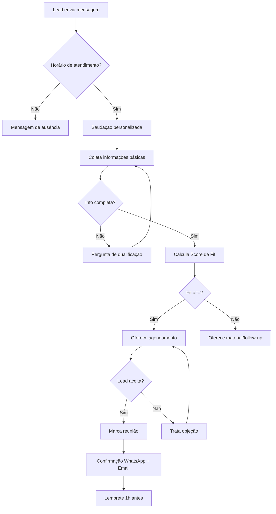
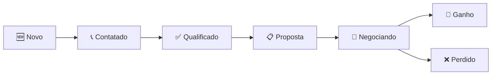

# Meu Agente — Guia de Produto, Planos e Uso

**Versão:** 1.0\
**Data:** Outubro/2025\
**Contato comercial:** [comercial@meuagente.api.br](mailto\:comercial@meuagente.api.br)

---

## Sumário

1. [Visão Geral](#sec-visao-geral)
2. [Planos e Preços](#sec-planos-precos)
3. [Matriz de Recursos por Plano](#sec-matriz)
4. [Sub‑Agentes e Funcionalidades](#sec-subagentes)
5. [Uso Diário (Fluxos no WhatsApp)](#sec-uso-diario)
6. [Integrações e Requisitos Técnicos](#sec-integracoes)
7. [Segurança, Privacidade e Conformidade](#sec-seguranca)
8. [Suporte e Backups](#sec-suporte)
9. [Boas Práticas e Limites do Canal](#sec-boas-praticas)
10. [Métricas e Relatórios](#sec-metricas)
11. [Perguntas Frequentes (FAQ)](#sec-faq)
12. [Anexos (Templates de Mensagem, Glossário)](#sec-anexos)

---


## 1) Visão Geral

**Meu Agente** é um micro SaaS que disponibiliza uma equipe de Agentes de IA operando diretamente em um número do **WhatsApp** para executar tarefas de **atendimento, operações e automação**. O objetivo é **reduzir tempo operacional**, **elevar conversão** e **padronizar processos**, preservando segurança e privacidade dos dados.

**Principais benefícios:**

- Atendimento 24/7 dentro das regras do WhatsApp Business.
- Integração com Google (Calendar, Drive, Tasks e Gmail) **não nativa**, disponível mediante implantação opcional **com custo adicional** nos planos **Business/Premium**.
- Operações financeiras simples (entradas/saídas) com exportação *(disponível nos planos pagos)*.
- Pesquisa na web, extração de dados de fontes permitidas e relatórios prontos.
- Sub‑agentes especializados (SDR, Marketing, Agendamento, Dev e Vídeo) no plano Business e Premium.

---


## 2) Planos e Preços

> Os valores abaixo estão **definidos e consolidados** para contratação. Impostos não inclusos.

### Plano **Free** — **Gratuito**

Para quem quer explorar o Meu Agente sem custo. **Sem automações automáticas via atendimento pelo WhatsApp**; os **registros são inseridos manualmente pelo usuário**. **Sem exportação de dados** e **sem backup**.

- Acesso ao app em nuvem do Meu Agente.
- Sem número dedicado, sem suporte e sem sub‑agentes Business/Premium.
- Operações manuais dentro do app (ex.: lançar entradas/saídas manualmente).
- Sem exportação (CSV/PDF) e **sem backups** (dados voláteis conforme política; recomenda-se migração para plano pago para garantir retenção).

### Plano **Básico** — **R\$ 497,00/mês**

Para profissionais e pequenas equipes que desejam começar com agentes de IA no WhatsApp usando infraestrutura em nuvem do Meu Agente.

**Observações do Básico:** acesso ao app e a diversas funcionalidades, porém com **lançamentos e interações manuais**, **sem automações automáticas** do Meu Agente, **sem suporte**, e **não inclui funcionalidades que são exclusivas dos planos Business e Premium** (ex.: **número WhatsApp dedicado**, **suporte prioritário 24/7**, **sub‑agentes SDR/Marketing/Dev/Vídeo** e **camadas avançadas de Web Search/Scrape**).

### Plano **Business** — **R\$ 997,00/mês**

Para empresas que precisam de \*\*número WhatsApp próprio \*\* suporte prioritário 24/7 e sub‑agentes adicionais (SDR-Recepcionista, Marketing, Agendamento, Dev e Vídeo), com maior capacidade de personalização.

- **Implantação (setup inicial) inclusa**.
- **Taxa de manutenção/treinamento/atualização:** **R\$ 149,00/h** (quando necessária), cobrindo ajustes de modelos, reconfigurações e treinamentos pontuais.

### Plano **Premium** — **R\$ 1497,00/mês**

Tudo do Business, com **camada avançada adicional** nos agentes de **Web Search** e **Scrape** (sempre em **fontes permitidas** e/ou **APIs oficiais**), automações estendidas, governança de dados ampliada e sub‑agentes adicionais (Agente de Confirmação, Agente de Resumo de Grupos, Agente de Remarketing e Agente de Follow‑up), com extrema capacidade de personalização.

- **Implantação (setup inicial) inclusa**.
- **Taxa de manutenção/treinamento/atualização:** **R\$ 149,00/h** (quando necessária), cobrindo ajustes de modelos, reconfigurações e treinamentos pontuais.

> **Add‑ons e ferramentas adicionais** (**somente plano Premium**): créditos de execução (ex.: tarefas de busca/extração ou minutos de geração de vídeo), integrações sob demanda e **bases de conhecimento adicionais**; os valores **variam conforme demanda** e a **necessidade de automações** a serem incluídas na estrutura.

---


## 3) Matriz de Recursos por Plano

| Recurso                                          | Free        | Básico      | Business           | Premium         |
| ------------------------------------------------ | ----------- | ----------- | ------------------ | --------------- |
| **Automação via atendimento no WhatsApp**        | –           | –           | ✔︎                 | ✔︎              |
| Agente Financeiro (entradas/saídas + categorias) | ✔︎          | ✔︎          | ✔︎                 | ✔︎              |
| Exportação de dados (CSV/PDF)                    | –           | ✔︎          | ✔︎                 | ✔︎              |
| Agente de Scrape (fontes permitidas/APIs)        | ✔︎ (básico) | ✔︎ (básico) | ✔︎ (intermediário) | ✔︎ (avançado)   |
| Agente Web Search                                | ✔︎          | ✔︎          | ✔︎                 | ✔︎ (avançado)   |
| Número WhatsApp dedicado                         | –           | –           | ✔︎                 | ✔︎              |
| **Implantação (setup inicial) inclusa**          | –           | –           | ✔︎                 | ✔︎              |
| **Suporte prioritário**                          | –           | –           | ✔︎ (24/7)          | ✔︎ (24/7)       |
| Agente SDR (qualificação de leads)               | –           | –           | ✔︎                 | ✔︎              |
| Agente de Marketing (Google Ads)                 | –           | –           | ✔︎                 | ✔︎              |
| Agente de Agendamento (Calendar/Drive/Tasks)     | –           | ✔︎          | ✔︎                 | ✔︎              |
| Agente de Dev (programação e debugging)          | –           | –           | ✔︎                 | ✔︎              |
| Agente de Vídeo (Google Veo 3)                   | –           | –           | ✔︎                 | ✔︎ (cota maior) |
| **Agente de Confirmação (Premium)**              | –           | –           | –                  | ✔︎              |
| **Agente de Resumo de Grupos (Premium)**         | –           | –           | –                  | ✔︎              |
| **Agente de Remarketing (Premium)**              | –           | –           | –                  | ✔︎              |
| **Agente de Follow‑up (Premium)**                | –           | –           | –                  | ✔︎              |
| Backups diários off‑site                         | –           | –           | –                  | ✔︎              |
| Governança de dados / auditoria                  | —           | Básico      | Interm.            | Avançado        |

> **Suporte:** no **Free e no Básico não há suporte**; nos planos **Business/Premium** o suporte é **prioritário 24/7**.

---


## 4) Sub‑Agentes e Funcionalidades

### 4.1 Agente Financeiro

- Registra **entradas e saídas**, categoria (ex.: marketing, operação, impostos) e **descrição**.
- Exportação **CSV**/planilha, filtros por período e categoria — **disponível apenas nos planos pagos**.

**Exemplos de mensagens no WhatsApp:**\
"Quero registrar uma saída de R\$ 320,00 em Marketing, descrição 'Impulsionamento Instagram', para hoje às 14:40."\
"Registra uma entrada de R\$ 1.200,00 na categoria Assinaturas — Plano Business — com data 01/10/2025."\
"Exporta um CSV do período de 01/09/2025 a 30/09/2025 apenas com as categorias Marketing e Operação."

---

### 4.2 Agente de Scrape (Fontes Permitidas)

- Extração de dados e conteúdos por **APIs oficiais**, **open data** e **fontes com permissão explícita**.
- Geração de **relatórios** (CSV/JSON) e **resumos** com referências.
- **Não** realiza scraping de sites que **proíbem** tal prática nos termos de uso.

**Exemplos de mensagens no WhatsApp:**\
"Faça o scrape do site exemplo.com e me envie os contatos comerciais (nome, e-mail e telefone) em CSV."\
"Busque no portal de dados abertos de Curitiba o dataset de aluguel residencial de 2024 e me mande um CSV filtrado por bairro."\
"Use a API 'imoveis\_publicos' e traga título, preço e bairro (até 200 itens) em JSON."

---

### 4.3 Agente Web Search

- Pesquisas avançadas por tema, fonte e localidade.
- Entrega de **resumos citados**, **links** e **anexos** (quando apropriado).

**Exemplos de mensagens no WhatsApp:**\
"Busque 3 pousadas em Fortaleza com potencial de vendas para o meu produto e me envie nomes, sites e telefones."\
"Pesquise tendências de 'roupas fitness' na região de SP nos últimos 90 dias e me entregue 5 insights com 3 links confiáveis."\
"Compare 'CRM para clínicas' e 'ERP para clínicas' focando em custo-benefício e me mande um resumo objetivo."

---

### 4.4 Agente SDR (Business/Premium)

O **Agente SDR (Sales Development Representative)** é uma das funcionalidades mais poderosas do Meu Agente, permitindo automatizar completamente a qualificação de leads e agendamento de reuniões via WhatsApp.

#### **Configuração Completa do SDR**

O agente SDR possui **6 abas de configuração** na interface do app:

##### **1. Identidade da Empresa**
Define o contexto e personalidade do agente:

- **Nome da Empresa**: Como o agente se apresenta
- **Nome do Representante**: Nome humano do agente (ex.: "Ana", "Carlos")
- **Telefone de Contato**: Número exibido nas mensagens
- **Email da Empresa**: Para envio de confirmações
- **Descrição da Empresa**: Texto completo sobre produtos/serviços, diferenciais, público-alvo e proposta de valor (até 2000 caracteres)
- **Segmento de Atuação**: Categoria da empresa (ex.: "Tecnologia", "Saúde", "Educação")
- **Site**: URL do site oficial

**Exemplo de Identidade:**
```
Nome: Consultoria MaxVision
Representante: Ana Silva
Descrição: "Somos a MaxVision, consultoria especializada em 
transformação digital para PMEs. Oferecemos implementação de CRM, 
automação de marketing e integração de sistemas. Atendemos 
empresas de 10-500 funcionários em todo Brasil."
```

##### **2. Apresentação e Saudação**
Customiza as primeiras mensagens do agente:

- **Mensagem de Boas-vindas**: Primeira mensagem ao lead
- **Tom de Voz**: Formal, Casual, Técnico, Amigável
- **Variáveis Dinâmicas**:
  - `{{nome_lead}}` - Primeiro nome do lead
  - `{{nome_empresa}}` - Nome da empresa
  - `{{representante}}` - Nome do agente
  - `{{horario}}` - Horário atual
  - `{{dia_semana}}` - Dia da semana

**Exemplo de Apresentação:**
```
"Olá {{nome_lead}}! 👋

Sou a {{representante}} da {{nome_empresa}}. Vi seu interesse 
em conhecer nossas soluções de CRM.

Posso te ajudar com algumas informações rápidas? Leva só 2 min! 😊"
```

##### **3. Qualificação de Leads**
Define os critérios BANT (Budget, Authority, Need, Timeline):

- **Perguntas de Qualificação** (arrastar para reordenar):
  1. Qual o principal desafio que você quer resolver?
  2. Qual o prazo ideal para implementação?
  3. Quem toma a decisão de compra na sua empresa?
  4. Qual o orçamento aproximado disponível?

- **Requisitos Obrigatórios** (checklist):
  - [ ] Nome completo
  - [ ] Email válido
  - [ ] Telefone com WhatsApp
  - [ ] Nome da empresa
  - [ ] Cargo/função
  - [ ] Tamanho da empresa (nº funcionários)
  - [ ] Urgência (alta/média/baixa)
  - [ ] Budget estimado

- **Critérios de Fit** (score automático):
  - **Alto Fit (8-10)**: Todos requisitos + orçamento adequado + urgência alta
  - **Médio Fit (5-7)**: Maioria requisitos + interesse claro
  - **Baixo Fit (0-4)**: Poucos requisitos ou sem budget/urgência

**Exemplo de Fluxo de Qualificação:**
```
SDR: "Qual o principal desafio que você quer resolver?"
Lead: "Preciso organizar melhor os contatos dos clientes"

SDR: "Entendi! E para quando você precisa dessa solução?"
Lead: "Idealmente nas próximas 2 semanas"

SDR: "Perfeito! Você é quem decide a contratação ou precisa 
validar com alguém?"
Lead: "Sou o dono, decido sozinho"

SDR: "Ótimo! Tem um orçamento definido para isso?"
Lead: "Até R$ 500/mês está ok"

[Sistema calcula: Fit ALTO - 9/10]
```

##### **4. Configuração de IA**
Controles finos do comportamento da IA:

- **Temperatura** (0.0 - 1.0): Criatividade das respostas
  - 0.3 = Formal e consistente
  - 0.7 = Balanceado (recomendado)
  - 1.0 = Criativo e variado
  
- **Top P** (0.0 - 1.0): Diversidade vocabular
  - 0.8 = Foco em respostas mais prováveis
  - 0.9 = Balanceado (recomendado)
  - 1.0 = Máxima diversidade

- **Max Tokens** (100 - 1000): Tamanho máximo da resposta
  - 300 = Respostas curtas e diretas
  - 500 = Balanceado (recomendado)
  - 800 = Respostas detalhadas

- **Presence Penalty** (-2.0 - 2.0): Penalidade por repetição
  - 0.0 = Sem penalidade
  - 0.6 = Evita repetições (recomendado)

- **Frequency Penalty** (-2.0 - 2.0): Penalidade por frequência
  - 0.0 = Sem penalidade
  - 0.5 = Varia linguagem (recomendado)

**Configuração Recomendada por Caso:**
```typescript
// Atendimento Formal (Jurídico, Saúde)
{ temperature: 0.5, top_p: 0.85, max_tokens: 400 }

// Atendimento Conversacional (Varejo, Serviços)
{ temperature: 0.7, top_p: 0.9, max_tokens: 500 }

// Atendimento Técnico (TI, Engenharia)
{ temperature: 0.3, top_p: 0.8, max_tokens: 600 }
```

##### **5. Tratamento de Objeções**
Biblioteca de respostas pré-configuradas:

**Técnicas de Resposta:**
- **Feel, Felt, Found**: "Entendo como você se sente. Outros clientes também sentiram isso. O que eles encontraram foi..."
- **Reversão**: Transformar objeção em benefício
- **Prova Social**: Casos de sucesso similares
- **Quebra de Risco**: Garantias, trials, demonstrações

**Objeções Comuns Pré-configuradas:**

| Objeção | Resposta Automática |
|---------|---------------------|
| "Está muito caro" | "Entendo! Posso mostrar o ROI que nossos clientes têm? Em média, recuperam o investimento em 3 meses. Quer ver um case similar ao seu?" |
| "Preciso pensar" | "Claro! Pra te ajudar a decidir melhor, qual ponto você quer avaliar? Preço, funcionalidades ou tempo de implementação?" |
| "Já uso outra ferramenta" | "Legal! Qual você usa? Posso te mostrar o que temos de diferente? Muitos clientes vieram de [ferramenta X] e tiveram [benefício]." |
| "Não tenho tempo agora" | "Sem problema! Quando seria melhor pra você? Posso te enviar um resumo por email e agendamos 15 min semana que vem?" |
| "Vou falar com a equipe" | "Perfeito! Quer que eu prepare um resumo executivo pra você apresentar? Facilita a decisão do time." |

**Como Adicionar Objeção Customizada:**
```
1. Clique em "+ Nova Objeção"
2. Digite a objeção: "Não tenho orçamento este trimestre"
3. Escolha técnica: "Feel, Felt, Found"
4. Digite resposta: "Entendo perfeitamente! Muitos clientes 
   começaram assim. O que fizemos foi dividir em parcelas menores 
   no cartão ou iniciar com o plano básico. Quer explorar?"
5. Salvar
```

##### **6. Limitações e Restrições**
Define o que o agente NÃO deve fazer:

- **Tópicos Proibidos** (lista):
  - Não discutir política
  - Não dar consultoria médica/jurídica
  - Não prometer prazos não confirmados
  - Não aplicar descontos sem autorização
  - Não coletar dados sensíveis (CPF, senha, cartão)

- **Horário de Atendimento**:
  - Seg-Sex: 08:00 - 18:00
  - Sáb: 09:00 - 13:00
  - Dom/Feriados: Apenas mensagem de ausência

- **Mensagem Fora do Horário**:
```
"Oi! Agora estamos fora do horário de atendimento. 
Nosso time volta Segunda às 08:00. 
Deixe sua mensagem que respondo assim que voltar! 😊"
```

- **Tempo Máximo de Conversa**: 15 mensagens
- **Ação Após Limite**: Transferir para humano / Agendar callback

#### **Múltiplas Instâncias SDR**

O Meu Agente permite configurar **múltiplos agentes SDR** simultâneos:

**Limites por Plano:**
- Business: 2 instâncias SDR
- Premium: 5 instâncias SDR

**Casos de Uso:**
1. **SDR por Produto**: Um agente para cada linha de produto
2. **SDR por Região**: Agentes com horários e linguagem regional
3. **SDR por Segmento**: B2B vs B2C com abordagens diferentes
4. **SDR por Idioma**: Português, Inglês, Espanhol

**Exemplo de Configuração Multi-instância:**
```
📱 Instância 1: "SDR Corporativo"
   - Foco: Empresas 50+ funcionários
   - Tom: Formal
   - Qualificação: Budget mínimo R$ 2.000/mês

📱 Instância 2: "SDR Varejo"
   - Foco: Pequenos negócios
   - Tom: Casual
   - Qualificação: Budget mínimo R$ 497/mês
```

#### **Playground de Testes**

Interface de testes antes de ativar:

```
┌─────────────────────────────────────┐
│  🧪 PLAYGROUND - Teste seu SDR      │
├─────────────────────────────────────┤
│  Você: Oi, quero saber mais         │
│                                     │
│  🤖 SDR: Olá! Sou a Ana da          │
│  MaxVision. Vi seu interesse...     │
│                                     │
│  Você: Quanto custa?                │
│                                     │
│  🤖 SDR: Ótima pergunta! Nossos     │
│  planos começam em R$ 497/mês...    │
└─────────────────────────────────────┘

[🔄 Resetar] [✅ Aprovar Config] [🚀 Ativar]
```

#### **Fluxo Completo do SDR**



#### **Integração com CRM**

Todos os leads qualificados vão automaticamente para o **CRM Pipeline** na coluna "Novo":

```sql
-- Dados salvos automaticamente
INSERT INTO evolution_contacts (
  name, phone, email, company, 
  crm_lead_status, -- 'novo'
  crm_lead_score,  -- 1-10
  crm_notes,       -- Transcrição da conversa
  crm_next_action  -- 'reuniao_agendada' ou 'follow_up'
)
```

**Mensagens humanizadas (exemplos):**\
"Oi, Ana! Sou do Meu Agente. Vi seu interesse em uma demo — te ajudo rapidinho."\
"Para te direcionar melhor: qual objetivo principal e para quando você precisa?"\
"Consigo quinta às 10:30 ou sexta às 14:00. Qual horário funciona?"\
"Perfeito. Fechei quinta às 10:30 por Google Meet. Te enviei a confirmação e o link aqui no WhatsApp e no seu e‑mail."\
"Se preferir, preparo um orçamento enxuto com base no que você descreveu. Quer receber ainda hoje?"


---

### 4.5 CRM Pipeline - Gestão Visual de Leads

O **CRM Pipeline** é um sistema Kanban completo integrado ao WhatsApp para gerenciar todo o funil de vendas, desde o primeiro contato até o fechamento.

#### **7 Estágios do Pipeline**



##### **Estágio 1: 🆕 Novo**
- **Descrição**: Leads que entraram no sistema mas ainda não foram contatados
- **Origem**: SDR automático, importação WhatsApp, formulário web
- **Ações Automáticas**: 
  - Alerta para vendedor em até 5 minutos
  - Score inicial calculado automaticamente
- **Campos Preenchidos**: Nome, telefone, origem
- **Tempo Máximo Recomendado**: 24 horas

##### **Estágio 2: 📞 Contatado**
- **Descrição**: Primeiro contato realizado com sucesso
- **Gatilho**: Mensagem WhatsApp enviada/respondida
- **Campos Obrigatórios**: Data do contato, quem contactou
- **Próximas Ações**: Agendar reunião ou enviar material
- **Tempo Médio**: 2-3 dias
- **Taxa de Conversão Esperada**: 40-60%

##### **Estágio 3**: ✅ Qualificado**
- **Descrição**: Lead atende critérios BANT (Budget, Authority, Need, Timeline)
- **Critérios de Qualificação**:
  - ✅ Tem orçamento definido
  - ✅ É o tomador de decisão ou influenciador
  - ✅ Tem necessidade clara do produto
  - ✅ Timeline de compra definido (até 90 dias)
- **Score Mínimo**: 6/10
- **Campos Obrigatórios**: Budget, prazo, necessidade
- **Taxa de Conversão Esperada**: 30-50%

##### **Estágio 4: 📋 Proposta**
- **Descrição**: Proposta comercial enviada e em análise
- **Documentos Gerados**: PDF com proposta, planilha de preços
- **Campos Obrigatórios**: 
  - Valor da proposta
  - Data de envio
  - Data de validade
  - Produtos/serviços incluídos
- **Follow-up Automático**: 3, 7 e 14 dias após envio
- **Taxa de Conversão Esperada**: 25-40%

##### **Estágio 5: 🤝 Negociando**
- **Descrição**: Cliente em negociação ativa (ajustes, descontos, prazos)
- **Indicadores**:
  - Objeções levantadas
  - Contraproposta recebida
  - Documentos jurídicos em análise
- **Ações Comuns**:
  - Apresentação de cases
  - Reunião com decisores
  - Trial/POC
- **Tempo Crítico**: Máximo 30 dias
- **Taxa de Conversão Esperada**: 40-60%

##### **Estágio 6: 🎉 Ganho**
- **Descrição**: Venda fechada e contrato assinado
- **Campos Finais**:
  - Valor fechado
  - Data de fechamento
  - Forma de pagamento
  - Previsão de início
- **Automações**:
  - Email de boas-vindas
  - Criar conta no sistema
  - Acionar onboarding
  - Registrar comissão

##### **Estágio 7: ❌ Perdido**
- **Descrição**: Lead não converteu
- **Motivos** (obrigatório registrar):
  - Preço alto
  - Escolheu concorrente
  - Sem budget
  - Sem urgência
  - Não respondeu (ghosting)
  - Outros
- **Ações Automáticas**:
  - Agendar follow-up em 90 dias
  - Adicionar a campanha de remarketing
  - Enviar pesquisa de feedback

#### **Interface Kanban**

```
┌─────────┬─────────┬─────────┬─────────┬─────────┬─────────┬─────────┐
│ 🆕 Novo │ 📞 Cont │ ✅ Qual │ 📋 Prop │ 🤝 Nego │ 🎉 Ganh │ ❌ Perd │
│  (12)   │  (8)    │  (5)    │  (3)    │  (2)    │  (1)    │  (4)    │
├─────────┼─────────┼─────────┼─────────┼─────────┼─────────┼─────────┤
│┌───────┐│┌───────┐│┌───────┐│┌───────┐│┌───────┐│┌───────┐│┌───────┐│
││Ana    ││││Carlos│││││Maria ││││Pedro │││││Bruno │││││Laura││││Joao  ││
││Silva  ││││Lima  │││││Costa ││││Souza│││││Alves │││││Rocha││││Pinto ││
││⭐⭐⭐⭐│││⭐⭐⭐  │││⭐⭐⭐⭐│││⭐⭐⭐⭐│││⭐⭐⭐⭐│││⭐⭐⭐⭐│││⭐⭐   ││
││R$2.5k ││││R$1.2k│││││R$3k  ││││R$5k │││││R$8k  │││││R$12k││││R$2k  ││
││📱Zap  ││││📱Zap │││││📱Zap ││││📱Zap│││││📱Zap │││││✅   ││││❌   ││
│└───────┘││└───────┘││└───────┘││└───────┘││└───────┘││└───────┘││└───────┘│
│         │         │         │         │         │         │         │
│[+ Card] │[+ Card] │[+ Card] │[+ Card] │[+ Card] │         │         │
└─────────┴─────────┴─────────┴─────────┴─────────┴─────────┴─────────┘
```

#### **Sidebar de Detalhes do Lead**

Ao clicar em qualquer card, abre Sheet lateral com 3 abas:

##### **Aba 1: 📋 Tarefas**
```
✅ Enviar proposta comercial
   📅 Concluída em 10/12 às 14:30
   
⏳ Ligar para confirmar recebimento
   📅 Hoje às 16:00
   🔔 Lembrete em 30 min
   
⬜ Agendar reunião de fechamento
   📅 Amanhã
```

**Funcionalidades:**
- Criar tarefa vinculada ao lead
- Marcar como concluída
- Definir prazo e lembrete
- Atribuir responsável

##### **Aba 2: 📅 Agenda**
```
📆 Próximos Eventos:

🗓️ Reunião de Apresentação
   15/12 às 10:00 (Google Meet)
   Duração: 30 min
   Link: meet.google.com/abc-def-ghi

🗓️ Demo do Produto
   18/12 às 14:00 (Presencial)
   Local: Escritório - Sala 3
```

**Funcionalidades:**
- Ver todos eventos do lead
- Criar novo evento
- Integração Google Calendar
- Enviar convite WhatsApp

##### **Aba 3: 📝 Notas**
```
🗓️ 14/12/2025 - 15:30
Por: João Vendedor

Cliente demonstrou interesse forte em 
automatizar WhatsApp. Mencionou que usa 
Zoho CRM atualmente. Budget aprovado de 
até R$ 2.000/mês. Decisor: CEO (ele mesmo).

Próximo passo: Enviar case de cliente similar.

---

🗓️ 10/12/2025 - 10:15
Por: Ana SDR

Qualificação inicial. Empresa tem 15 
funcionários. Urgência média (30-60 dias).
```

**Funcionalidades:**
- Adicionar nota com timestamp automático
- Editar notas anteriores
- Anexar arquivos
- Mencionar outros usuários (@joao)

#### **Integração WhatsApp + CRM**

Toda interação via WhatsApp é automaticamente registrada no CRM:

```typescript
// Fluxo de sincronização
1. Lead envia mensagem WhatsApp
   ↓
2. Sistema identifica/cria contato
   ↓
3. Adiciona mensagem nas notas
   ↓
4. Atualiza "última interação"
   ↓
5. Se palavras-chave detectadas:
   - "proposta" → Move para "Proposta"
   - "reunião" → Cria evento na agenda
   - "não tenho interesse" → Move para "Perdido"
```

**Exemplo de Nota Automática:**
```
🤖 Mensagem WhatsApp - 15/12 16:45

Cliente: "Recebi a proposta. Está dentro 
do que conversamos. Só preciso validar com 
o sócio até sexta."

Status atualizado: Proposta → Negociando
```

#### **Métricas do Pipeline**

Painel de métricas em tempo real:

| Métrica | Valor | Comparação |
|---------|-------|------------|
| 📊 **Taxa de Conversão Geral** | 18.5% | +2.3% vs mês anterior |
| 💰 **Valor Total em Pipeline** | R$ 145.000 | +R$ 23k vs semana anterior |
| ⏱️ **Tempo Médio de Fechamento** | 28 dias | -5 dias vs média |
| 🎯 **Deals Fechados (mês)** | 12 | Meta: 15 (80%) |
| 💸 **Ticket Médio** | R$ 4.150 | +12% vs trimestre anterior |
| 📉 **Taxa de Perda** | 22% | -3% vs mês anterior |

**Conversão por Estágio:**
```
Novo → Contatado: 65%
Contatado → Qualificado: 52%
Qualificado → Proposta: 38%
Proposta → Negociando: 55%
Negociando → Ganho: 48%
```

#### **Filtros e Segmentação**

```
🔍 Filtros Disponíveis:

Por Vendedor: [Todos ▼]
Por Origem: [WhatsApp, SDR, Formulário, Indicação]
Por Score: [Alto (8-10), Médio (5-7), Baixo (0-4)]
Por Budget: [< R$500, R$500-2k, R$2k-5k, > R$5k]
Por Prazo: [Urgente (7d), Curto (30d), Médio (90d), Longo (>90d)]
Por Produto: [Produto A, Produto B, Produto C]
Última Interação: [Hoje, 3 dias, 7 dias, 30 dias]
```

**Visualizações:**
- 📊 Kanban (padrão)
- 📋 Lista
- 📅 Timeline
- 📈 Funil (métricas)

---

### 4.6 Importação de Contatos WhatsApp

Sincronização manual de contatos do WhatsApp para o CRM do Meu Agente.

#### **Processo de Sincronização**

##### **Passo 1: Conectar Instância WhatsApp**

Na página "Agente SDR", conecte sua instância:
```
1. Escaneie QR Code
   ou
2. Use Pairing Code (código de 8 dígitos)

Status: 🟢 Online
Contatos: 2.347 encontrados
```

##### **Passo 2: Filtrar Contatos**

Antes de sincronizar, escolha quais contatos importar:

```
✅ Incluir contatos individuais (recomendado)
❌ Excluir listas de transmissão
❌ Excluir grupos
✅ Apenas contatos com nome salvo
✅ Apenas contatos com interação recente (90 dias)
```

**Filtros Avançados:**
- Excluir contatos bloqueados
- Apenas contatos com foto de perfil
- Apenas contatos verificados (WhatsApp Business)
- Filtrar por tags específicas

##### **Passo 3: Sincronizar**

```
[🔄 Sincronizar Contatos]

Progresso: ████████░░ 78% (1.831/2.347)

⏱️ Tempo estimado: 2 minutos
```

**O que é sincronizado:**
- Nome do contato
- Número de telefone
- Foto de perfil (URL)
- Status WhatsApp
- Última mensagem (data/hora)
- Grupos em comum (se habilitado)

#### **Cache Persistente**

O Meu Agente usa **cache persistente** (não TTL):

```typescript
// Sistema ANTIGO (removido)
❌ TTL auto-refresh a cada 15 minutos
❌ Sincronização automática em segundo plano

// Sistema ATUAL (recomendado)
✅ Sincronização MANUAL pelo usuário
✅ Cache persiste indefinidamente
✅ Controle total sobre quando atualizar
```

**Vantagens do Cache Persistente:**
- ⚡ Performance: Dados carregam instantaneamente
- 💾 Economia: Menos chamadas à Evolution API
- 🎯 Controle: Usuário decide quando atualizar
- 🔒 Estabilidade: Menos risco de rate limit

**Quando Sincronizar:**
- Ao adicionar novos contatos no WhatsApp
- Após campanhas de captação
- Semanalmente (como boa prática)
- Antes de filtrar/segmentar para campanhas

#### **Preservação de Dados CRM**

A sincronização **preserva todos os campos do CRM**:

```sql
-- Lógica de upsert
INSERT INTO evolution_contacts (
  remote_jid, name, phone, profile_picture_url
) VALUES (...)
ON CONFLICT (remote_jid, instance_id) 
DO UPDATE SET
  name = EXCLUDED.name,
  profile_picture_url = EXCLUDED.profile_picture_url,
  last_message_timestamp = EXCLUDED.last_message_timestamp
  -- CRM fields NÃO são atualizados:
  -- crm_lead_status, crm_lead_score, crm_notes, 
  -- crm_next_action, crm_assigned_to
```

**Campos Preservados:**
- Status do lead (novo/contatado/qualificado/etc)
- Score de qualificação
- Notas e histórico
- Tarefas vinculadas
- Eventos agendados
- Tags personalizadas
- Responsável pelo lead

#### **Integração com CRM Pipeline**

Após sincronização, contatos ficam disponíveis no CRM:

```
Contatos Importados: 1.831

Distribuição:
🆕 Novo: 1.650 (sem status CRM definido)
📞 Em Pipeline: 181 (já estavam no CRM)

Ação Recomendada:
1. Revisar 1.650 novos contatos
2. Aplicar tags/segmentação
3. Definir status inicial ("Novo")
4. Atribuir a vendedores
```

**Operações em Massa:**
```
☑️ Selecionar Todos (ou filtrados)

Ações em massa:
- Alterar status → [Novo ▼]
- Adicionar tag → [Cliente Potencial]
- Atribuir a → [João Vendedor ▼]
- Exportar → [CSV, Excel]
- Deletar
```

---

### 4.7 Limites de Planos e Recursos

Tabela completa de limites e cotas por plano:

| Recurso | Free | Basic | Business | Premium |
|---------|------|-------|----------|---------|
| **WhatsApp** |
| Instâncias SDR | 0 | 0 | 2 | 5 |
| Mensagens/mês | - | - | 10.000 | 50.000 |
| Webhooks | - | - | Incluído | Incluído |
| **CRM** |
| Leads no pipeline | 50 | 100 | 1.000 | Ilimitado |
| Contatos WhatsApp | 100 | 500 | 5.000 | 25.000 |
| Tarefas por lead | 5 | 10 | Ilimitado | Ilimitado |
| Eventos/mês | 10 | 50 | 500 | Ilimitado |
| **Armazenamento** |
| Espaço total | 100 MB | 1 GB | 10 GB | 50 GB |
| Anexos por lead | 3 | 5 | 20 | Ilimitado |
| Backup | ❌ | ❌ | ❌ | ✅ Diário |
| **Chat IA** |
| Sessões/mês | 10 | 50 | 200 | 1.000 |
| Mensagens/sessão | 10 | 20 | 50 | 100 |
| Contexto | Básico | Básico | Avançado | Avançado |
| **Financeiro** |
| Transações/mês | 50 | 200 | 1.000 | Ilimitado |
| Categorias custom | 5 | 10 | 30 | Ilimitado |
| Exportações/mês | 0 | 10 | 50 | Ilimitado |
| **Integrações** |
| Google Calendar | ❌ | ✅ | ✅ | ✅ |
| Google Drive | ❌ | ❌ | ✅ | ✅ |
| N8N Webhooks | ❌ | ❌ | ✅ | ✅ |
| APIs Customizadas | ❌ | ❌ | ❌ | ✅ |
| **Suporte** |
| Email | ❌ | 48h | 24h | 4h |
| Chat | ❌ | ❌ | ✅ | ✅ |
| WhatsApp | ❌ | ❌ | ✅ | ✅ |
| Telefone | ❌ | ❌ | ❌ | ✅ |

#### **Validação de Limites**

O sistema valida limites em **3 camadas**:

##### **1. Frontend (UI)**
```typescript
// Exemplo: Bloquear criação de nova instância SDR
if (currentPlan === 'business' && instances.length >= 2) {
  showUpgradeDialog('Você atingiu o limite de 2 instâncias SDR.');
  return;
}
```

##### **2. Backend (Edge Functions)**
```typescript
// Supabase Edge Function valida antes de criar
const { count } = await supabase
  .from('evolution_instances')
  .select('*', { count: 'exact' })
  .eq('phone', userPhone);

if (planId === 'business' && count >= 2) {
  return new Response('Limite atingido', { status: 403 });
}
```

##### **3. Database (RLS Policies)**
```sql
-- Política RLS impede insert acima do limite
CREATE POLICY "enforce_instance_limit_business"
ON evolution_instances FOR INSERT
WITH CHECK (
  CASE 
    WHEN get_user_plan_id(phone) = 'business' THEN
      (SELECT COUNT(*) FROM evolution_instances 
       WHERE phone = get_user_phone_optimized()) < 2
    ELSE true
  END
);
```

#### **Notificações de Limite**

```
⚠️ Você está próximo do limite

Instâncias SDR: 2/2 (100%)
Mensagens: 9.450/10.000 (94.5%)
Armazenamento: 8.2 GB/10 GB (82%)

[Ver Detalhes] [Fazer Upgrade]
```

**Quando alertar:**
- 80%: Notificação suave (badge laranja)
- 90%: Alerta forte (toast amarelo)
- 100%: Bloqueio (modal vermelho + upgrade)

---

### 4.8 Agente de Marketing (Google Ads) (Business/Premium)

- Análises de campanhas, relatório de termos, **sugestões de otimização**.
- Rotinas de alerta (ex.: gasto diário, queda brusca de CTR).

**Exemplos de mensagens no WhatsApp:**\
"Analise minha campanha de Google Ads 'Tráfego – Outubro' e me diga 3 termos negativos para adicionar."\
"Porque meu gasto diário está estourando na metade do dia?"\
"Compare a última semana com a anterior e me envie 5 insights rápidos com links dos relatórios."

---

### 4.6 Agente de Agendamento (Business/Premium)

- Cria e gerencia compromissos no **Google Calendar e/ou app Meu Agente**, manuseia arquivos no **Google Drive**, cria tarefas no **Google Tasks** e envia lembretes no WhatsApp.

**Exemplos de mensagens no WhatsApp:**\
"Marque uma reunião com o João amanhã às 15:00 no Google Meet e envie o link para ele e para mim."\
"Crie uma tarefa no Google Tasks: 'Enviar proposta para Maria' com prazo sexta às 17:00."\
"Anexe o arquivo 'Proposta\_v3.pdf' do Drive na reunião de segunda às 10:00."

---

### 4.7 Agente de Dev (Business/Premium)

- Suporte em múltiplas linguagens, **debugging** e sugestões de melhoria.
- Respeita limites de confidencialidade e logs.

**Exemplos de mensagens no WhatsApp:**\
"Revise meu endpoint `/api/checkout`; estou recebendo erro 500 quando envio `customerId` vazio."\
"Otimize esta query Postgres que ficou lenta ao filtrar por `created_at` no último mês."\
"Sugira testes unitários para o módulo de cobrança e me mostre exemplos de casos de borda."

---

### 4.8 Agente de Vídeo – Google Veo 3 (Business/Premium)

- Geração de vídeos a partir de prompts/roteiros alinhados ao branding do cliente.
- Entregáveis: clipes curtos (cotas por plano), arquivos mp4.

**Exemplos de mensagens no WhatsApp:**\
"Crie um vídeo de 30s em 1080x1920 com o roteiro: 'Bem‑vindo ao Meu Agente...' e me envie duas variações."\
"Adapte este roteiro para clínicas odontológicas e gere um vídeo curto para stories."\
"Monte um storyboard com 6 cenas e legendas e depois exporte o MP4 final."

---

### 4.9 Agentes Premium adicionais

- **Agente de Confirmação:** entra em contato diariamente, nos horários pré‑definidos, com os leads agendados no Google Calendar do dia para confirmar presença; realiza varredura diária no Google Tasks e lembra tarefas pendentes.
- **Agente de Resumo de Grupos:** envia resumo diário dos grupos do WhatsApp escolhidos pelo cliente com os pontos mais relevantes das últimas 24h. *Requer consentimento e observância das regras do grupo.*
- **Agente de Remarketing:** identifica contatos que já interagiram no histórico do WhatsApp e dispara mensagens de reengajamento com base em funil pré‑definido. *Fora da janela de 24h, usa templates aprovados; requer opt‑in e respeito a políticas do canal.*
- **Agente de Follow‑up:** localiza contatos inativos por período configurável (minutos, horas, dias, meses, anos) e aciona lembretes conforme regra. *Mensagens proativas seguem a política de templates e opt‑in.*
- **Backups diários off‑site:** cópias armazenadas diariamente em local distinto da infraestrutura principal, com política 3‑2‑1 e testes periódicos de restauração.

> **Camada avançada de pesquisa e extração no plano Premium:** Agente Web Search e Agente de Scrape e Extract operam com **recursos aprofundados** e maior cobertura **exclusivamente em fontes permitidas e/ou APIs oficiais**, mantendo conformidade com termos de uso e legislação vigente.

---


## 5) Uso Diário (Fluxos no WhatsApp)

**Como falar com o Meu Agente**\
Escreva normalmente, como você falaria com alguém no WhatsApp. Abaixo, exemplos práticos (copiar e colar) por tipo de agente.

**Financeiro**

- "Registra uma entrada de R\$ 1.200,00 na categoria Assinaturas — Plano Business — com data 01/10/2025."
- "Quero registrar uma saída de R\$ 320,00 em Marketing, descrição 'Impulsionamento Instagram', hoje às 14:40."
- "Exporta um CSV do período de 01/09/2025 a 30/09/2025 somente com as categorias Marketing e Operação."

**Web Search (Pesquisa)**

- "Busque 3 pousadas em Fortaleza com potencial de vendas para o meu produto e me envie nomes, sites e telefones."
- "Pesquise concorrentes de 'açaí delivery' em Curitiba e me traga 5 insights com 3 links confiáveis."
- "Compare 'CRM para clínicas' e 'ERP para clínicas' focando em custo‑benefício e me mande um resumo objetivo."

**Scrape/Extract (Fontes Permitidas/APIs)**

- "Faça o scrape do site exemplo.com e me envie os contatos comerciais (nome, e‑mail e telefone) em CSV."
- "Busque no portal de dados abertos de Curitiba o dataset de aluguel residencial de 2024 e me mande um CSV filtrado por bairro."
- "Use a API 'imoveis\_publicos' e traga título, preço e bairro (até 200 itens) em JSON."

**Agendamento**

- "Marque uma reunião com o João amanhã às 15:00 no Google Meet e envie o link para ele e para mim."
- "Crie uma tarefa no Google Tasks: 'Enviar proposta para Maria' com prazo sexta às 17:00."
- "Anexe o arquivo 'Proposta\_v3.pdf' do Drive na reunião de segunda às 10:00."

**SDR (Qualificação e Reunião/Orçamento)**

- "Qualifique este lead: Ana, 11 99999‑9999, interessada em demo — me diga o fit e o próximo passo."
- "Ofereça dois horários (qui 10:30 ou sex 14:00) e, se ela aceitar, marque a reunião e envie confirmação."
- "Com base na conversa, monte um orçamento enxuto e me envie para revisão."

**Vídeo (Veo 3)**

- "Crie um vídeo de 30s em 1080x1920 com o roteiro: 'Bem‑vindo ao Meu Agente...' e me envie duas variações."
- "Adapte este roteiro para clínicas odontológicas e gere um vídeo curto para stories."
- "Monte um storyboard com 6 cenas e legendas e depois exporte o MP4 final."

---


## 6) Integrações e Requisitos Técnicos

- **WhatsApp Business** para envio/recebimento e mensagens.
- **Google Workspace**: Calendar, Drive, Tasks, Gmail (OAuth, escopos mínimos).
- **Formatos de exportação**: CSV/JSON/PDF (conforme agente).
- **Ambiente**: infraestrutura gerenciada (cloud), logs e monitoramento.

---


## 7) Segurança, Privacidade e Conformidade

- **LGPD**: definição de bases legais por finalidade; canal do **Encarregado (DPO)**; direitos do titular; políticas de retenção e descarte.
- **Consentimento e opt‑out**: registro do opt‑in; **SAIR**/"pare" como palavra de parada.
- **Scraping**: respeito a termos de uso.
- **Backups**: política **3‑2‑1** com testes de restauração periódicos.

---


## 8) Suporte e Backups

- **Suporte:** **sem suporte (Free e Básico)**; **24/7 prioritário** (Business/Premium).

- **Backups:** **indisponível no Free e no Básico**; **off‑site diário incluído no Premium**. No Business (padrão) não há; pode ser contratado como **add‑on**.

---


## 9) Boas Práticas e Limites do Canal

- Evite excesso de disparos (risco de queda de qualidade). Priorize segmentação.
- Para grupos, observe regras internas e consentimento dos participantes.
- Configure **opt‑out** claro e automático.

---


## 10) Métricas e Relatórios

- **Vendas:** conversão por etapa, no‑show de reuniões, ticket médio — com exportação e download pela dashboard em **.CSV** e **.PDF** *(apenas planos pagos)*.
- **Marketing:** CTR de templates, taxa de opt-in/opt-out, ROI de campanhas.
- **Operações:** lançamentos financeiros por período/categoria, tarefas concluídas.

Relatórios entregues via painel e/ou arquivos (CSV/PDF).

---


## 11) Perguntas Frequentes (FAQ)

**1. Posso usar o Meu Agente sem número próprio?**\
Sim, no **Free** e no **Básico** o atendimento ocorre na infraestrutura do Meu Agente.

**2. O que muda no Business/Premium?**\
Número WhatsApp dedicado, **implantação inclusa**, suporte 24/7 e sub‑agentes adicionais. O Premium inclui automações e integrações avançadas e governança ampliada.

**3. Como funcionam as mensagens proativas?**\
Fora de 24h, somente com **template aprovado** e opt‑in do contato.

**4. Há taxa de manutenção?**\
Sim, **R\$ 149,00/h**, quando solicitada (ajustes de modelos, reconfigurações, treinamentos).

**5. Vocês fazem scraping de sites que proíbem?**\
Não. Trabalhamos apenas com **APIs oficiais** e **fontes permitidas**.

---

### \*Observações Comerciais Finais

- Os limites de consumo (ex.: execuções de busca/extração, minutos de vídeo) e integrações específicas são detalhados na **Proposta Comercial** de cada cliente.
- Ajustes fora de escopo são tratados como **add‑ons** sob demanda.

