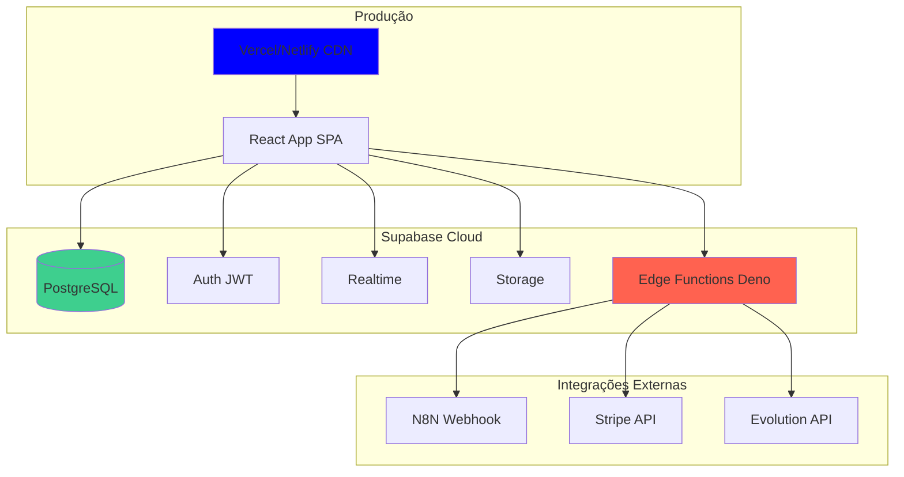

# 🚀 Guia de Deployment (Deploy)

> **Última Atualização:** 15 de Dezembro de 2025  
> **Versão do App:** 2.0.0  
> **Autor:** Equipe Meu Agente

---

## 📋 Índice

1. [Visão Geral](#visão-geral)
2. [Pré-requisitos](#pré-requisitos)
3. [Variáveis de Ambiente](#variáveis-de-ambiente)
4. [Deploy Frontend (Vite)](#deploy-frontend-vite)
5. [Deploy Backend (Supabase)](#deploy-backend-supabase)
6. [Deploy Edge Functions](#deploy-edge-functions)
7. [Configuração de Integrações](#configuração-de-integrações)
8. [Checklist Pré-Deploy](#checklist-pré-deploy)
9. [Troubleshooting](#troubleshooting)
10. [FAQ](#faq)

---

## 🎯 Visão Geral

O **Meu Agente** é uma aplicação fullstack com:

- **Frontend:** React + Vite (SPA)
- **Backend:** Supabase (DB + Auth + Realtime + Edge Functions)
- **Integrações:** N8N, Stripe, Evolution API

### Arquitetura de Deploy



---

## 🔧 Pré-requisitos

### Contas Necessárias

- ✅ [Supabase](https://supabase.com) - Projeto criado
- ✅ [Vercel](https://vercel.com) ou [Netlify](https://netlify.com) - Para frontend
- ✅ [Stripe](https://stripe.com) - Conta configurada
- ✅ [N8N](https://n8n.io) - Instância rodando (self-hosted ou cloud)
- ✅ [Evolution API](https://evolution-api.com) - Instância configurada

### Ferramentas de Desenvolvimento

```bash
# Node.js
node -v  # v18.x ou superior

# Supabase CLI
npm install -g supabase

# Git
git --version
```

---

## 🌍 Variáveis de Ambiente

### Frontend (.env.production)

```bash
# Supabase
VITE_SUPABASE_URL=https://seu-projeto.supabase.co
VITE_SUPABASE_ANON_KEY=eyJhbGciOiJIUzI1NiIsInR5cCI6IkpXVCJ9...

# N8N Webhook
VITE_N8N_WEBHOOK_URL=https://webhook.meuagente.api.br/webhook

# Ambiente
VITE_APP_ENV=production
VITE_APP_VERSION=2.0.0
```

### Backend (Supabase Edge Functions Secrets)

```bash
# Stripe
STRIPE_SECRET_KEY=sk_live_...
STRIPE_WEBHOOK_SECRET=whsec_...
STRIPE_PRICE_BASIC=price_1SbygeDUMJkQwpuNfKOSWoRL
STRIPE_PRICE_BUSINESS=price_1SWpI2DUMJkQwpuNYUAcU5ay
STRIPE_PRICE_PREMIUM=price_1SWpI4DUMJkQwpuN9NfkqZzL

# Evolution API
EVOLUTION_API_URL=https://evolution.meuagente.api.br
EVOLUTION_API_KEY=seu-api-key-aqui

# Supabase Service Role (para Edge Functions)
SUPABASE_SERVICE_ROLE_KEY=eyJhbGciOiJIUzI1NiIsInR5cCI6IkpXVCJ9...
SUPABASE_URL=https://seu-projeto.supabase.co

# N8N
N8N_WEBHOOK_URL=https://webhook.meuagente.api.br
```

### Como Configurar Secrets no Supabase

```bash
# Configurar secret individualmente
supabase secrets set STRIPE_SECRET_KEY=sk_live_...

# Ou via arquivo .env
supabase secrets set --env-file ./supabase/.env.production

# Listar secrets configurados
supabase secrets list
```

---

## 🎨 Deploy Frontend (Vite)

### Opção 1: Vercel (Recomendado)

#### Passo 1: Conectar Repositório

```bash
# Via Vercel CLI
npm install -g vercel
vercel

# Ou via Dashboard
# 1. Acesse https://vercel.com/new
# 2. Importe repositório do GitHub
# 3. Configure projeto
```

#### Passo 2: Configurar Build

```json
{
  "framework": "vite",
  "buildCommand": "npm run build",
  "outputDirectory": "dist",
  "installCommand": "npm install",
  "devCommand": "npm run dev"
}
```

#### Passo 3: Variáveis de Ambiente

```
Dashboard Vercel > Settings > Environment Variables

Adicionar:
- VITE_SUPABASE_URL
- VITE_SUPABASE_ANON_KEY
- VITE_N8N_WEBHOOK_URL
- VITE_APP_ENV=production
```

#### Passo 4: Deploy

```bash
vercel --prod
```

#### Configurações Avançadas (vercel.json)

```json
{
  "buildCommand": "npm run build",
  "outputDirectory": "dist",
  "framework": "vite",
  "headers": [
    {
      "source": "/(.*)",
      "headers": [
        {
          "key": "X-Frame-Options",
          "value": "DENY"
        },
        {
          "key": "X-Content-Type-Options",
          "value": "nosniff"
        },
        {
          "key": "Referrer-Policy",
          "value": "strict-origin-when-cross-origin"
        }
      ]
    }
  ],
  "rewrites": [
    {
      "source": "/(.*)",
      "destination": "/index.html"
    }
  ]
}
```

---

### Opção 2: Netlify

#### Passo 1: Configurar Build

`netlify.toml`

```toml
[build]
  command = "npm run build"
  publish = "dist"

[build.environment]
  NODE_VERSION = "18"

[[redirects]]
  from = "/*"
  to = "/index.html"
  status = 200

[[headers]]
  for = "/*"
  [headers.values]
    X-Frame-Options = "DENY"
    X-Content-Type-Options = "nosniff"
```

#### Passo 2: Deploy

```bash
# Via Netlify CLI
npm install -g netlify-cli
netlify deploy --prod

# Ou via Dashboard
# Conecte repositório GitHub
```

---

## 🗄️ Deploy Backend (Supabase)

### Passo 1: Criar Projeto Supabase

```bash
# Via Dashboard
1. Acesse https://supabase.com/dashboard
2. Clique em "New Project"
3. Escolha organização
4. Nome: meu-agente-prod
5. Senha do banco (salve com segurança)
6. Região: São Paulo (sa-east-1)
7. Plano: Pro (mínimo para produção)
```

### Passo 2: Aplicar Migrations

```bash
# Link projeto local com Supabase
supabase link --project-ref seu-project-ref

# Aplicar todas as migrations
supabase db push

# Verificar status
supabase db diff
```

### Passo 3: Configurar Auth

```bash
# Via Dashboard > Authentication > Settings

# Site URL
https://app.meuagente.api.br

# Redirect URLs (separados por vírgula)
https://app.meuagente.api.br/**
https://app.meuagente.api.br/auth/callback

# Email Templates
- Confirmar Email: Customizar template
- Reset Password: Customizar template
- Magic Link: Desabilitado
```

### Passo 4: Configurar Storage

```bash
# Via Dashboard > Storage

# Criar buckets
1. profile-pics (público)
2. backups (privado)
3. documents (privado)

# RLS policies aplicadas automaticamente
```

### Passo 5: Habilitar Realtime

```sql
-- Via SQL Editor
ALTER PUBLICATION supabase_realtime ADD TABLE clientes;
ALTER PUBLICATION supabase_realtime ADD TABLE chat_ia_messages;
ALTER PUBLICATION supabase_realtime ADD TABLE notifications;
```

---

## ⚡ Deploy Edge Functions

### Passo 1: Deploy Todas as Functions

```bash
# Deploy todas de uma vez
supabase functions deploy

# Ou uma por vez
supabase functions deploy create-checkout-session
supabase functions deploy stripe-webhook
supabase functions deploy create-evolution-instance
# ... etc
```

### Passo 2: Configurar Secrets

```bash
# Via CLI
supabase secrets set STRIPE_SECRET_KEY=sk_live_...
supabase secrets set STRIPE_WEBHOOK_SECRET=whsec_...
supabase secrets set EVOLUTION_API_URL=https://...
supabase secrets set EVOLUTION_API_KEY=...
supabase secrets set N8N_WEBHOOK_URL=https://...

# Verificar
supabase secrets list
```

### Passo 3: Testar Edge Functions

```bash
# Obter URL da função
supabase functions list

# Testar localmente primeiro
supabase functions serve create-checkout-session --env-file ./supabase/.env.local

# Testar em produção
curl -X POST https://seu-projeto.supabase.co/functions/v1/create-checkout-session \
  -H "Authorization: Bearer SEU_ANON_KEY" \
  -H "Content-Type: application/json" \
  -d '{"price_id": "price_123"}'
```

### Logs das Edge Functions

```bash
# Ver logs em tempo real
supabase functions logs create-checkout-session --tail

# Ver últimos 100 logs
supabase functions logs stripe-webhook --limit 100
```

---

## 🔗 Configuração de Integrações

### Stripe

#### 1. Configurar Webhook

```bash
# Via Stripe Dashboard > Developers > Webhooks

Endpoint URL:
https://seu-projeto.supabase.co/functions/v1/stripe-webhook

Eventos para escutar:
- checkout.session.completed
- customer.subscription.created
- customer.subscription.updated
- customer.subscription.deleted
- invoice.payment_succeeded
- invoice.payment_failed

Webhook Signing Secret:
whsec_... (copiar e adicionar aos secrets)
```

#### 2. Configurar Produtos

```bash
# Via Stripe Dashboard > Products

Criar produtos:
1. Meu Agente Basic - R$ 97,90/mês
   Price ID: price_1SbygeDUMJkQwpuNfKOSWoRL

2. Meu Agente Business - R$ 497,00/mês
   Price ID: price_1SWpI2DUMJkQwpuNYUAcU5ay

3. Meu Agente Premium - R$ 1.497,00/mês
   Price ID: price_1SWpI4DUMJkQwpuN9NfkqZzL

Configurar:
- Recorrente mensal
- Moeda: BRL
- Billing interval: month
```

---

### N8N

#### 1. Criar Workflow

```bash
# Via N8N Editor

Fluxo: Agente SDR
1. Webhook Trigger
   URL: https://webhook.meuagente.api.br/webhook/agente-sdr
   Method: POST

2. Supabase Node
   Query: SELECT config_json FROM sdr_agent_config WHERE instance_id = ...

3. Function Node
   Montar contexto para OpenAI

4. OpenAI Node
   Model: gpt-4-turbo-preview
   System Prompt: Contexto do agente

5. HTTP Request Node
   Enviar resposta via Evolution API

6. Supabase Node (opcional)
   Salvar no CRM
```

#### 2. Ativar Workflow

```
Production Executions: ✅ Enabled
Error Workflow: Configurar para notificações
```

---

### Evolution API

#### 1. Configurar Instância

```bash
# Via Evolution API Dashboard

Nome: meuagente-production
API Key: Gerar e salvar
Webhook URL: https://webhook.meuagente.api.br/webhook/agente-sdr
```

#### 2. Configurar CORS

```json
{
  "cors": {
    "origin": [
      "https://app.meuagente.api.br",
      "https://seu-projeto.supabase.co"
    ],
    "credentials": true
  }
}
```

---

## ✅ Checklist Pré-Deploy

### Frontend

- [ ] Variáveis de ambiente configuradas
- [ ] Build roda sem erros (`npm run build`)
- [ ] Lint sem warnings críticos (`npm run lint`)
- [ ] PWA manifesto configurado
- [ ] Favicon e ícones gerados
- [ ] Meta tags SEO configuradas
- [ ] Analytics configurado (opcional)

### Backend

- [ ] Todas as migrations aplicadas
- [ ] RLS habilitado em todas as tabelas
- [ ] Testes pgTap passando
- [ ] Auth URLs configuradas
- [ ] Storage buckets criados
- [ ] Realtime habilitado nas tabelas necessárias

### Edge Functions

- [ ] Todas as functions deployadas
- [ ] Secrets configurados
- [ ] Testes de integração passando
- [ ] Logs monitorados
- [ ] Webhooks configurados

### Integrações

- [ ] Stripe webhook configurado e testado
- [ ] N8N workflow ativo
- [ ] Evolution API conectada
- [ ] CORS configurado em todos os serviços

### Segurança

- [ ] HTTPS habilitado (sempre)
- [ ] Headers de segurança configurados
- [ ] CSRF protection ativo
- [ ] Rate limiting configurado (Supabase)
- [ ] Secrets não commitados no Git

### Monitoramento

- [ ] Supabase Dashboard configurado
- [ ] Alerts configurados (uptime, errors)
- [ ] Logs centralizados
- [ ] Backups automáticos habilitados

---

## 🔧 Troubleshooting

### Build do Frontend Falha

**Erro:** `Module not found` ou `Cannot resolve module`

**Solução:**
```bash
# Limpar cache
rm -rf node_modules dist
npm install
npm run build
```

---

### Edge Function Retorna 500

**Erro:** `Internal Server Error`

**Debug:**
```bash
# Ver logs detalhados
supabase functions logs nome-funcao --tail

# Testar localmente
supabase functions serve nome-funcao --debug
```

---

### Stripe Webhook Falha

**Erro:** `Webhook signature verification failed`

**Solução:**
```bash
# Verificar secret está correto
supabase secrets list | grep STRIPE_WEBHOOK_SECRET

# Atualizar secret
supabase secrets set STRIPE_WEBHOOK_SECRET=whsec_novo_valor

# Testar webhook via Stripe CLI
stripe listen --forward-to https://seu-projeto.supabase.co/functions/v1/stripe-webhook
```

---

## ❓ FAQ

**Q: Quanto tempo demora o deploy completo?**  
R: Frontend: 2-5 minutos | Backend: 5-10 minutos | Total: ~15 minutos

**Q: Posso fazer rollback se der erro?**  
R: ✅ Frontend (Vercel/Netlify): Sim, rollback instantâneo | Backend (Supabase): Use migrations down

**Q: Como fazer deploy apenas de uma Edge Function?**  
R: `supabase functions deploy nome-da-funcao`

**Q: Preciso redeployar frontend se mudar Edge Function?**  
R: ❌ Não. Edge Functions são independentes.

**Q: Como configurar domínio customizado?**  
R: Via Vercel/Netlify Dashboard > Domains > Add custom domain

---

## 📚 Recursos Adicionais

### Documentação Relacionada

- [Resumo Implementação Trial](./RESUMO_IMPLEMENTACAO_TRIAL.md)
- [Período Arrependimento CDC](./PERIODO_ARREPENDIMENTO_CDC.md)

### Links Úteis

- [Vite Deploy](https://vitejs.dev/guide/static-deploy.html)
- [Supabase CLI](https://supabase.com/docs/guides/cli)
- [Vercel Documentation](https://vercel.com/docs)

---

**Documento mantido por:** Equipe Meu Agente  
**Última revisão:** 15/12/2025  
**Próxima revisão prevista:** 15/01/2026
